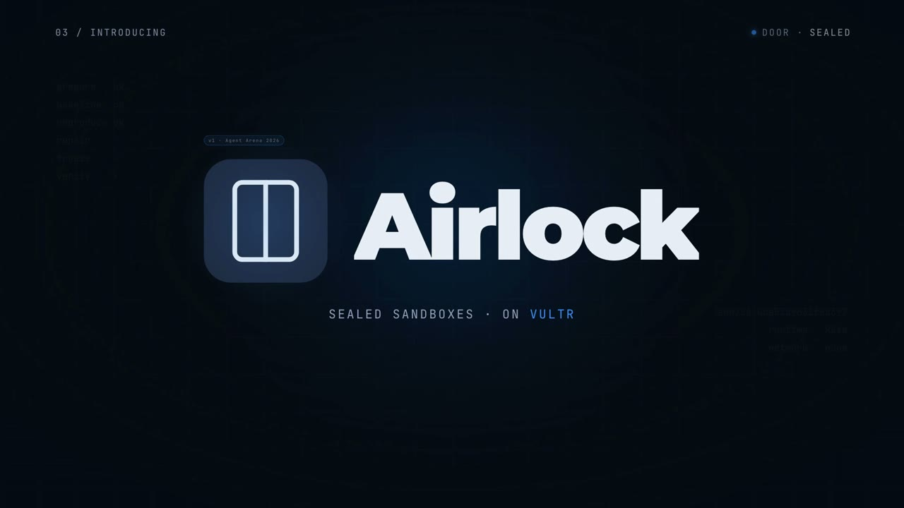
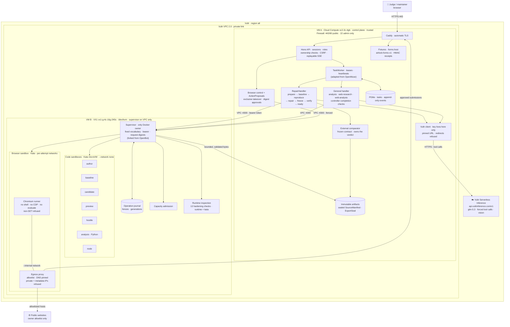
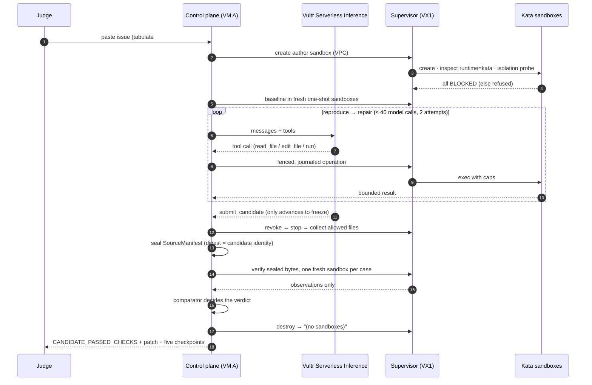
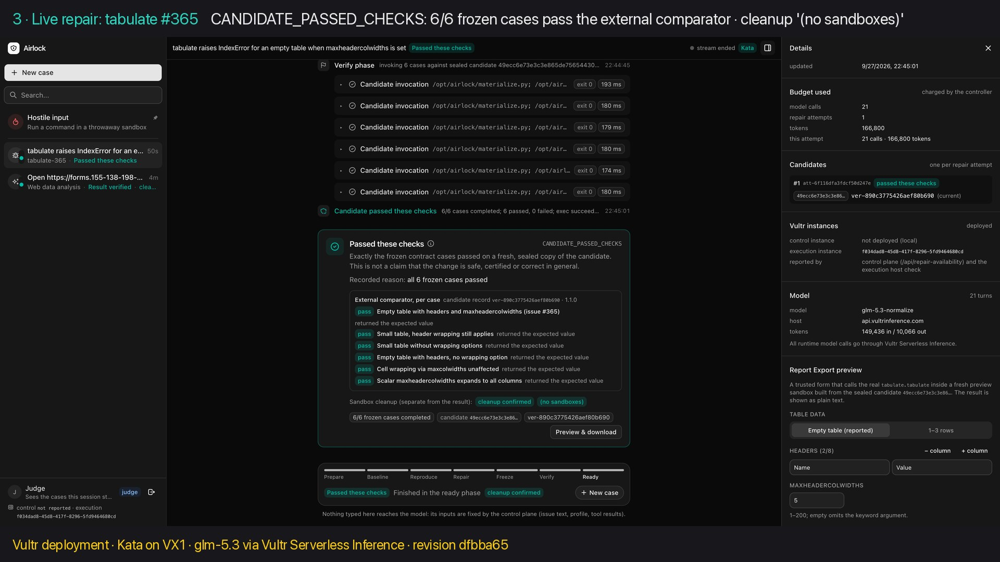
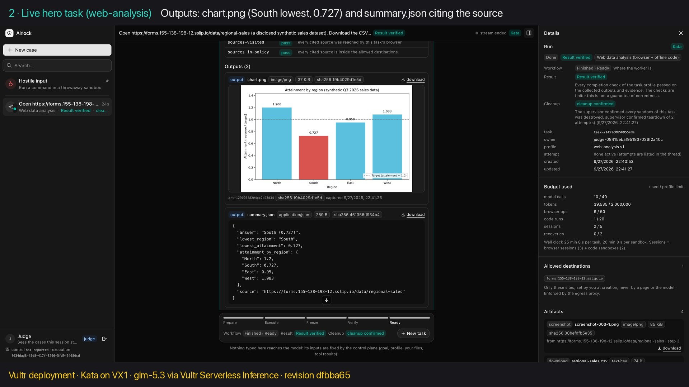
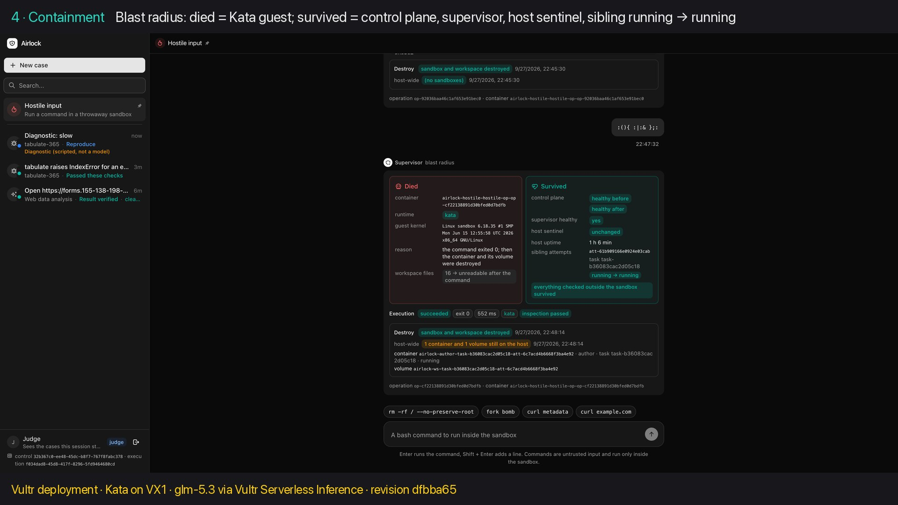
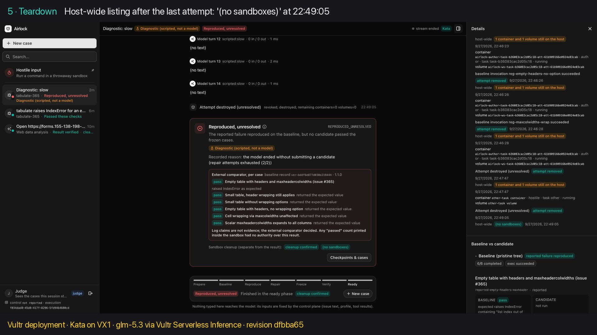

<div align="center">

# Airlock

**Let the agent do anything. Nothing it does can touch you.**

An AI agent that does real work (repairs real bugs, browses the real web, runs real analysis), where every action runs in a disposable Kata microVM on **Vultr** and every result is judged by checks the agent cannot fake.

[](#-hackathon-submission)
[](#-how-airlock-solves-blast-radius-zero)
[](https://155-138-198-12.sslip.io)
[](docs/demo/vultr-demo.mp4)

[](https://www.vultr.com/products/cloud-inference/)
[](https://www.vultr.com/products/vx1-compute/)
[](https://www.vultr.com/pricing/)
[](https://www.vultr.com/products/vpc/)
[](https://www.vultr.com/api/#tag/firewall)
[](https://www.vultr.com/api/)

[](docs/evidence/vultr/)
[](docs/evidence/live-gate/)
[](docs/evidence/vultr/acceptance-f223c19/)
[](#-the-five-checkpoints)
[](https://katacontainers.io/)
[](https://gvisor.dev/)
[](docs/configuration.md#testing)


[](THIRD_PARTY_NOTICES.md)

<br />

<a href="docs/demo/airlock-intro.mp4"></a>

<sub><b>▶ <a href="docs/demo/airlock-intro.mp4">Intro (1:40)</a></b> · <b>▶ <a href="docs/demo/vultr-demo.mp4">Live walkthrough on the Vultr deployment (2:20)</a></b>: instance 0:06 · hero task 0:25 · live repair 1:06 · <b>containment 1:45</b> · teardown 2:03</sub>

</div>

---

## ⚡ In 30 seconds

- **Real work, not a chat.** Paste a real bug report and Airlock reproduces it, repairs it with `glm-5.3` on **Vultr Serverless Inference**, and returns a patch. Or give it a goal and it drives a real **Chromium**, downloads data, and analyses it offline into a chart with cited sources.
- **Blast radius zero.** Every command, page and line of model-written code runs in a **Kata microVM on a Vultr VX1 host**. It has its own guest kernel, no network (the browser gets only an allowlisting proxy), no secrets, hard caps, and it is destroyed after use. `rm -rf /` and fork bombs die inside their sandbox while everything else keeps running.
- **The agent can't mark its own homework.** Success is decided by an external comparator, on sealed bytes, in fresh sandboxes. A forged "all tests passed" log still fails.
- **Deployed and measured on Vultr:** preflight **49/49**, live repair **3/3**, end-to-end acceptance **9/9** with the live model.

**Try it:** https://155-138-198-12.sslip.io. Sign in with the judge password shared with the submission (it is never stored in this repo). Then start a repair (the `tabulate-365` profile), run a web-analysis task, or paste `rm -rf / --no-preserve-root` into **Hostile input**.

---

## 🏆 Hackathon submission

Built at **The Agent Arena Hackathon** (hosted by Vultr, San Francisco, 26–27 Sep 2026) for **Challenge 1: Blast Radius Zero, Safe Agent Execution on Vultr**. The brief: a web agent that does real work (writing and running code, or operating a real browser) where every action is contained in a sandbox on Vultr, and a central control layer plans, dispatches and returns verifiable output.

---

## 🛡 How Airlock solves Blast Radius Zero

The kickoff turned the brief into four judge questions. Here are the answers, each backed by evidence:

| The judge asks | Airlock's answer | Proof |
|---|---|---|
| **"Show me the instance."** | Two Vultr VMs in `atl`: VM A `vc2-2c-4gb` (control) and VM B **VX1** `vx1-g-4c-16g-240s` (sandboxes, `/dev/kvm`). Every run record carries the host check of the machine that ran it, and the UI shows both instance IDs. | [01-instance-host-check](docs/assets/vultr/01-instance-host-check.jpg) |
| **"Is the model yours, or a borrowed key?"** | Every agent turn goes to **Vultr Serverless Inference**. The model was picked by a measured tool-call round trip on the live `/v1/models` list, and each turn records model, host and tokens. | [live-gate receipt](docs/evidence/live-gate/) |
| **"Is Vultr planning and dispatching?"** | The control plane on VM A owns phases, budgets and the model loop, and dispatches every tool call over the **VPC** to the supervisor on VX1. Nothing from a report or the model runs in the app process. | [Architecture](#-architecture) |
| **"If I paste `rm -rf /`, what dies?"** | Only that sandbox: its Kata guest kernel `6.18.35` (host `6.8.0`). The control plane, supervisor, host sentinel and a sibling task survive, and the card ends with `(no sandboxes)`. | [06-hostile-rm-rf](docs/assets/vultr/06-hostile-rm-rf.jpg) · [07-forkbomb-sibling-survived](docs/assets/vultr/07-hostile-forkbomb-sibling-survived.jpg) |

**The four containment focus areas**

| Focus area | Control | Measured on VX1 |
|---|---|---|
| **Process isolation** | Kata microVM per sandbox (gVisor installed as the floor, `runc` refused in production). The runtime is **inspected, never assumed**: 13 hardening checks are read back from the actual container before every dispatch. | guest kernel differs from host; runtime recorded as `kata` |
| **Secret hygiene** | No model key, token, Docker socket, host mount, cookie or metadata route inside any sandbox. Provider credentials exist only on VM A. | isolation probe: metadata, DNS, TCP, socket, mounts all **BLOCKED** |
| **Resource limits** | 1 CPU · 512 MiB · 64 PIDs · 30 s/command · 64 KiB output · 5 min/attempt · capped workspace. Host-wide capacity admission refuses (429) before any Docker call. | workspace quota stops at 127/128 MiB; fork bomb contained |
| **Lifecycle discipline** | revoke → stop → confirm → collect → destroy, with fencing so late results are ignored. A janitor reconciles leftovers after crashes. | host-wide listing `(no sandboxes)` after every run |

---

## 🟦 Built on Vultr

| Vultr product | What Airlock uses it for | Where |
|---|---|---|
| [**Serverless Inference**](https://www.vultr.com/products/cloud-inference/) | Every agent model call: `glm-5.3` with forced tool calls (`-normalize` for standard tool-call IDs), text and vision. Pinned base URL `https://api.vultrinference.com/v1`, redirects refused. | [`apps/control/src/vultr-client.ts`](apps/control/src/vultr-client.ts) |
| [**VX1 Cloud Compute**](https://www.vultr.com/products/vx1-compute/) | The sandbox host. VX1 "supports customer virtualization" and exposes `/dev/kvm`, so each sandbox is a **Kata microVM** with its own kernel. This follows the direction of Vultr's [agent sandboxing guide](https://docs.vultr.com/how-to-set-up-agent-sandboxing-on-vultr-cloud-compute) (KVM microVMs on VX1). | VM B · [`deploy/host/sandbox-host.sh`](deploy/host/sandbox-host.sh) |
| [**Cloud Compute**](https://www.vultr.com/pricing/) | The trusted control plane (`vc2-2c-4gb`): API, worker, comparator, artifacts, web UI, TLS. | VM A · [`deploy/host/control-host.sh`](deploy/host/control-host.sh) |
| [**VPC 2.0**](https://www.vultr.com/products/vpc/) | Private control → supervisor link. The supervisor binds only to its VPC address; VM B's only public port is SSH, open to admin IPs. | [`deploy/vultr/provision.sh`](deploy/vultr/provision.sh) |
| [**Firewall groups**](https://www.vultr.com/api/#tag/firewall) | VM A: 443/80 public, 22 from admin IPs. VM B: 22 from admin IPs only. | `provision.sh` |
| [**API v2**](https://www.vultr.com/api/) | One-command, idempotent provisioning (VPC, firewalls, both VMs, SSH key), key checks and teardown. | [`deploy/vultr/`](deploy/vultr/) · [`scripts/check-keys.ts`](scripts/check-keys.ts) |

Region `atl` keeps inference traffic in-region. The two VMs cost roughly $0.18/hour together (Vultr plans API); `deploy/vultr/destroy.sh` removes everything.

---

## 🧭 Architecture



**One authority per concern.** The model owns nothing.

| Component | Owns | Never |
|---|---|---|
| **Control plane** (VM A) | identities, contracts, phases, budgets, sessions, export, the model client | holds a Docker socket, runs candidate code, trusts sandbox output |
| **Supervisor** (VM B) | container identity, execution, deadlines, termination, cleanup, isolation checks | accepts an image, mount, network, runtime or host path from a caller |
| **Comparator** | required case IDs, expected behaviour, the verdict | imports or executes candidate code |
| **Artifact service** | canonical bytes and digests | replaces an immutable record |
| **Model** | nothing: it proposes edits and tool calls | declares success, grants privileges, publishes |

### The repair loop: plan → dispatch → verify



**General tasks** use the same control plane and supervisor. The hero `web-analysis` task goes:

1. Navigate the allowlisted page in the Kata browser and take a screenshot.
2. Download the CSV.
3. The bytes cross into an offline Python sandbox, which produces a chart and `summary.json`.
4. The controller runs 8 completion checks (sources visited, in policy, cited, outputs valid, …) and returns `RESULT_VERIFIED`.

**Form submissions** need a human:

1. The model proposes an immutable `ActionProposal`.
2. A person approves by restating its exact digest.
3. The controller types a one-use HMAC code into the page.
4. The destination confirms with a receipt.

The model never sees the code.

<details>
<summary><b>Security invariants (checked on every change)</b></summary>

1. One authority per concern (table above).
2. Untrusted code runs only in its assigned sandbox. Nothing from a report runs on VM A.
3. Candidate identity is immutable: verify, preview and export all use one sealed digest.
4. The worker cannot declare success. `passed` fields, exit codes and logs from inside the sandbox carry no authority.
5. Cancellation has an execution effect: revoke → stop → confirm → fence late results.
6. Ownership is checked at every access. IDs are not bearer tokens.
7. No secrets, network or host in any sandbox. The single exception is the browser, which reaches only its own allowlisting proxy.
8. The runtime tier is inspected, never assumed: Kata is the target, gVisor the floor, runc dev-only.
9. Every run record carries the five checkpoints.
10. All runtime model calls go through Vultr Serverless Inference.

</details>

---

## 🔍 The five checkpoints

Every run record, task page and export bundle carries all five:

| # | Checkpoint | What it proves |
|---|---|---|
| 1 | **Host check** | CPU virtualization, `/dev/kvm`, runtimes, selected runtime, `devUnsafe=false` |
| 2 | **Execution log** | every command with exit code, duration and bounded output |
| 3 | **In-sandbox identity** | `hostname` + `uname -a` from inside (Kata guest `6.18.35` ≠ host `6.8.0`) |
| 4 | **Isolation probe** | metadata · DNS · TCP · Docker socket · host mounts: anything not `BLOCKED` refuses the run **before** agent work |
| 5 | **Teardown** | host-wide listing must read `(no sandboxes)` |

<table>
<tr>
<td><br/><sub>Live repair: 6/6 frozen cases pass the external comparator</sub></td>
<td><br/><sub>Hero: browser → CSV → offline analysis → chart</sub></td>
</tr>
<tr>
<td><br/><sub>Fork bomb: that guest died, the sibling task survived</sub></td>
<td><br/><sub>Teardown: <code>(no sandboxes)</code></sub></td>
</tr>
</table>

---

## ✅ Evidence (deployed on Vultr, live model)

| Gate | Result | Evidence |
|---|---|---|
| **Preflight on the VX1 host** (KVM, Kata, 13 hardening checks, isolation probe, workspace quota, Chromium sandbox under Kata, egress-only-via-proxy, metadata and form POSTs refused, empty host) | **49/49** | [docs/evidence/vultr/](docs/evidence/vultr/) |
| **Live repair gate**: fresh tabulate #365 repairs through the public URL, judged by the comparator | **3/3** | [docs/evidence/live-gate/](docs/evidence/live-gate/) |
| **Vultr acceptance**: analysis · web research · live repair + byte-identical export · hero (2 data variants) · approvals with destination receipt · human takeover · Kata containment · two-judge isolation · empty host | **9/9** | [acceptance-f223c19](docs/evidence/vultr/acceptance-f223c19/) |
| **Negative controls**: forged "tests passed" log → `CHECKS_FAILED`; changed approval digest → 409; replayed approval → 409; other judge → 404; off-allowlist navigation → 422 | pass | [acceptance-f223c19](docs/evidence/vultr/acceptance-f223c19/); forged log: [Vultr smoke](docs/evidence/vultr/smoke-20260927T164034Z.txt) (scripted driver) |
| **Crash/restart** (local `runc`, scripted drivers, not the deployment): control plane or supervisor killed mid-operation; nothing uncertain is replayed | 7/7 | [docs/acceptance-matrix.md](docs/acceptance-matrix.md) |
| **Findings ledger**: 95 audited requirements | 0 open (1 conditional, 1 optional) | [docs/implementation-status.md](docs/implementation-status.md) |

The six terminal outcomes are `NOT_REPRODUCED`, `REPRODUCED_UNRESOLVED`, `CANDIDATE_PASSED_CHECKS`, `CHECKS_FAILED`, `INCONCLUSIVE` and `STOPPED_LIMIT`. "Passed these checks" means exactly that the frozen cases passed on sealed bytes. It never means safe, certified or correct in general.

---

## 💡 What's new here

The two-VM layout (control VM + sandbox host) is the expected baseline for this challenge. What Airlock adds on top:

- **Verification the agent cannot influence.** A frozen contract, an external comparator, sealed candidates and fresh sandboxes per case. The agent is an author inside the workflow, never its judge.
- **Execution you can reason about after a crash.** Every supervisor mutation is journaled before dispatch and fenced by generation, so uncertainty surfaces as `unknown`, never as an invented receipt.
- **A browser that can't be turned against you.** Chromium keeps its own sandbox inside a Kata microVM. It sits behind a per-attempt proxy with DNS pinning and a private-IP refusal, has no shell, CDP or evaluate, and can submit forms only after a digest-bound human approval.
- **Honest claims.** The runtime tier is inspected per run. Repair is enabled in production only while a live-gate receipt matches the running model, runtime, image and contract.

<details>
<summary><b>Why Kata on VX1, and not OpenSandbox or Microsandbox?</b></summary>

Kata gives each sandbox its own guest kernel through Docker's OCI runtime interface. That lets one narrow supervisor keep Docker's inspection, labels and lifecycle verbs while getting microVM isolation from VX1's `/dev/kvm`. gVisor stays installed as the floor. Vultr's own guide demonstrates the same KVM-microVM approach with Microsandbox. We chose Kata because the whole hardening, inspection and journaling layer is built on Docker's API. See `research/38-kickoff-decks-and-netbird-clarification.md` §3.6.

</details>

---

## 🧩 Built on OpenMuse + OpenBot (built here vs reused)

Airlock adapts audited modules from two MIT-licensed repositories. **Neither upstream app is the composition root**, and neither CopilotKit Intelligence nor AG-UI is a dependency. The pins are OpenMuse [`205cc386`](THIRD_PARTY_NOTICES.md) and OpenBot [`3c73cf00`](THIRD_PARTY_NOTICES.md); the browser plane uses OpenBot `1ac9c35b` and OpenMuse `34b15bc8`.

| Capability | Upstream source | Airlock | What changed |
|---|---|---|---|
| Durable orchestration | OpenMuse `engine/worker.ts` | `apps/control/src/worker/` | `RepairHandler` + general handler at the `TaskHandler` seam; the model no longer decides when it has finished |
| Task storage | OpenMuse `db.ts` | `apps/control/src/store/` | PGlite; immutable inserts; append-only events with per-task sequence |
| Sessions & routes | OpenMuse `auth.ts`, `routes.ts` | `sessions.ts`, `api.ts` | judge/operator roles, per-login ownership, SSE replay, CSRF |
| Guarded model tools | OpenMuse `engine/model.ts` | `repair-handler.ts` | pattern only; a deterministic phase machine replaces the model deciding when it has finished |
| Container hardening | OpenMuse `computer.ts` | `apps/supervisor/src/runtime.ts`, `exec.ts` | moved **inside VM B**; per-attempt identity; runtime verified on inspect |
| Narrow privileged service | OpenBot `supervisor/src/*` | `apps/supervisor/src/index.ts`, `names.ts`, `docker-api.ts` | disposable per-attempt roles; exec, freeze, hostile; request digests |
| Browser runner | OpenBot `agent-computer/*` | `runtime/browser/` | transient profile, proxy-only, no CDP/evaluate, unix-socket protocol |
| Egress policy & proxy | OpenMuse `worker/network.ts`, `proxy.ts` | `apps/egress/` | resolve once, connect to the validated IP; CGNAT/IPv4-mapped refused |
| Web UI shell | OpenBot `app/src/*` | `apps/web/` | layout and components; Airlock data and flows |

**Built here:** the RepairHandler and general task loop, the Vultr client, the supervisor execution/freeze protocol, generation fencing and the operation journal, capacity admission, the bounded collector and pristine materializer, the external comparator, artifact manifests with sealed export, the browser/egress plane wiring, approvals with the `airlock-forms-v1` destination, the five checkpoints, the deploy/preflight/acceptance tooling and all tests. Every copied file, its pin and its modifications are listed in [THIRD_PARTY_NOTICES.md](THIRD_PARTY_NOTICES.md).

---

## 🚀 Run it

**On Vultr** (two VMs, all scripted; details in [docs/runbook.md](docs/runbook.md)):

```sh
bun scripts/check-keys.ts                        # VULTR_API_KEY + VULTR_INFERENCE_API_KEY, read-only checks, never printed
deploy/vultr/register-ssh-key.sh                 # idempotent
deploy/vultr/provision.sh                        # VPC 2.0, firewall groups, VM A (vc2) + VM B (VX1)
deploy/deploy.sh --driver scripted              # hosts, Kata, pinned images, supervisor, control, TLS
deploy/preflight.sh                              # 49 runtime-tier checks on VM B
bun scripts/probe-model.ts glm-5.3               # measured tool-call round trip picks the model
deploy/deploy.sh --driver vultr --model glm-5.3 --skip-host-setup
bun scripts/live-gate.ts --n 3                   # live repair gate → commit the receipt
deploy/deploy.sh --only control --skip-host-setup # reload receipts; repair turns on in production
deploy/vultr/destroy.sh                          # when done
```

**Locally** (macOS/Colima, `runc`, every record labelled `dev-unsafe`):

```sh
bun install --frozen-lockfile
./run.sh            # builds images and UI, starts supervisor + control, streams the debug log
./run.sh smoke      # end to end through the HTTP API
./run.sh test       # control, supervisor (real Docker), web, runtime
```

Environment variables, the debug log, adding a profile and the full test matrix are covered in **[docs/configuration.md](docs/configuration.md)**.

---

## ⚖️ Limits (stated, not hidden)

- One supported repair profile (`tabulate-365`, a labelled historical replay). Other repo/runtime combinations are rejected with 422. 3/3 is one known bug, not a general success rate.
- The browser only reads the open web. Non-GET requests are refused except on the approval-gated form destination, WebSockets and web workers are blocked, and there is no logged-in browsing. GET requests to hosts the owner allowlisted can still carry data.
- `RESULT_VERIFIED` means the profile's structural checks passed, not that an answer is correct.
- One control-plane process (PGlite). Splitting API and worker means moving to Postgres.
- NetBird (the optional bonus) is not set up. SSH is limited to admin IPs, and the supervisor listens only on the VPC.

## 🔭 What's next

- More repair profiles as real adapters (one directory each, plus a pinned image).
- One throwaway VX1 instance per task through the Vultr API, for tenant-level isolation.
- A NetBird peer link for control → supervisor, and judge-role gating for the public URL.
- Postgres to scale the control plane horizontally.

---

<div align="center">
<sub>Adapted modules keep their upstream notices ([THIRD_PARTY_NOTICES.md](THIRD_PARTY_NOTICES.md)) · development guideline in [CLAUDE.md](CLAUDE.md) · research in <code>research/</code></sub>
</div>
