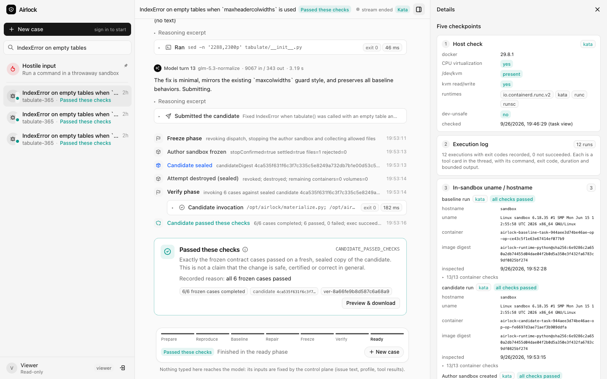
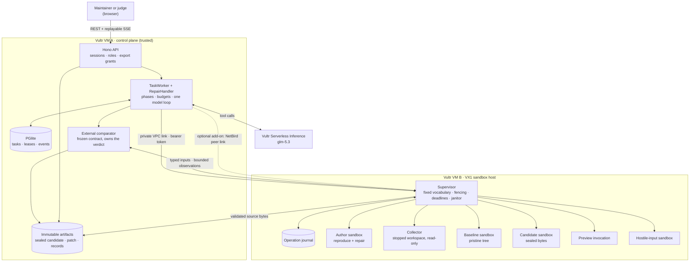

<div align="center">

# Airlock

**Give the agent a stranger's bug report. Get back a patch you can try, with checks the agent could not fake, while every line of untrusted code runs in a disposable sandbox.**

[](#hackathon-fit)
[](#hackathon-fit)
[](#status)
[](https://144-202-21-168.sslip.io)

[](https://www.vultr.com/products/serverless-inference/)
[](https://docs.vultr.com/how-to-set-up-agent-sandboxing-on-vultr-cloud-compute)
[](https://katacontainers.io/)
[](https://gvisor.dev/)


<br />
<br />



<sub>A live-gate run on the deployment (glm-5.3 via Vultr Serverless Inference, sandboxes under Kata on the VX1 host), captured signed out before task data required a session.</sub>

</div>

Airlock is a web agent that does real work in disposable sandboxes on Vultr. It has two task kinds. **General tasks** run a goal under a controller-selected profile (`analysis`, `web-research`, `web-analysis`) with real headless Chromium behind a per-task egress proxy, offline Python and Node sandboxes, owner uploads, screenshots, human takeover, and approvals for supported form submissions only; the controller's completion checks, never the model, decide the result. **Repair** takes an untrusted bug report for a supported library, reproduces the failure in a disposable sandbox on Vultr, attempts a minimal repair, and returns a patch with **externally measured** before/after behavior. The agent can edit the candidate; it can never edit the acceptance contract, grant itself privileges, publish its work, or decide that it passed. The result of a run is one of six terminal outcomes; "Passed these checks" means exactly that the frozen contract cases passed on a sealed candidate, measured by a comparator that never imports the candidate.

## Hackathon fit

Built at **The Agent Arena Hackathon** (Vultr, NetBird, Cerebral Valley; San Francisco, 26–27 Sep 2026) for **Challenge 1, Blast Radius Zero**: a web agent that does real work while every action stays inside a sandbox on Vultr.

| The judge asks | What Airlock shows |
|---|---|
| **"Show me the instance."** | A Vultr VM backend: the control plane on VM A and the supervisor that owns Docker on a VX1 sandbox host (VM B). Every run record carries the host check from the machine that ran it. |
| **"Is the model yours, or a borrowed key?"** | Every agent call goes to Vultr Serverless Inference (`api.vultrinference.com`); the run page shows the model id, host, `finish_reason` and token counts for each turn. No other provider is in the runtime path. |
| **"Is Vultr planning and dispatching?"** | The control plane plans the task, drives the model and dispatches every tool call to the supervisor; nothing the report or the model produces runs in the app process. |
| **"If I paste `rm -rf /`, what dies?"** | The Hostile input panel runs it in a fresh sandbox and answers with a blast-radius card: what died (that sandbox, its runtime and guest kernel) and what survived (control plane, supervisor, other tasks, a host sentinel), then the teardown listing. |
| **Secret hygiene, limits, lifecycle** | No key, token, Docker socket, host mount or network route in any sandbox; CPU, memory, PID, time, output and disk caps on every run; every sandbox destroyed, with `(no sandboxes)` recorded. |

## Status

**This branch (`fix/milestone-1-guarantees`) is not yet deployed.** It closes the gap audit ([research/42](research/42-AIRLOCK-GAP-AUDIT.md)) and adds doc 40's browser and general execution (stages 0–5); the per-finding ledger is [docs/implementation-status.md](docs/implementation-status.md) and the independent requirement-to-evidence matrix is [docs/acceptance-matrix.md](docs/acceptance-matrix.md).

- **Verified locally on real Docker** (Colima, plain `runc`, labelled dev-unsafe; scripted diagnostic drivers, no live model): an independent acceptance run passed 20/20 local rows — fresh-CSV analysis whose outputs match their sha256 and change with the input, Chromium research with a real screenshot, repair pass and forged-log failure with byte-identical sealed exports, cross-owner isolation, cancel-after-teardown, takeover, stale-reference refusal, approval refusals (wrong digest, replay, expiry), hostile commands with a responsive control plane and no secrets in any sandbox, egress refusals, restart honesty and an empty host afterwards. Browser containment was also exercised against real public sites (allowed navigation, blocked hosts/metadata/private addresses, blocked form POSTs, bounded downloads).
- **Blocked on Vultr access** (not claimed): Kata/gVisor measurements for the new browser and code roles, the durable per-attempt storage decision (D1), the host egress firewall on VX1, a fresh live-repair gate receipt (repair stays disabled in production until one is committed), the vision round trip, live-model general tasks, and the demo recording.

The earlier deployment of `main` (before this branch) is described below; its measurements apply to that revision only.

- **Deployed on Vultr, `atl` (main, before this branch):** control plane on `vhp-2c-4gb-amd` (VM A) behind Caddy TLS at **https://144-202-21-168.sslip.io**; supervisor on a **VX1** `vx1-g-4c-16g-240s` (VM B), bound to its VPC address only, with **Kata Containers** as the sandbox runtime (gVisor `runsc` installed as the floor). About $0.19/hour for both. Details, scripts and teardown: [`deploy/README.md`](deploy/README.md).
- **Isolation, measured on VM B** (`deploy/preflight.sh`): `/dev/kvm` present; every sandbox runs a **guest kernel `6.18.35` under Kata** while the host runs `6.8.0-139-generic`; the supervisor's inspection records `runtime=kata`, `devUnsafe=false`; the isolation probe reports metadata, DNS, outbound TCP, Docker socket and host mounts all **BLOCKED**; `169.254.169.254` is unreachable from inside a sandbox; teardown `(no sandboxes)`. Port 4300 is not reachable from the internet.
- **Smoke against the deployment:** diagnostic repair `CANDIDATE_PASSED_CHECKS`, forged "tests passed" log `CHECKS_FAILED`, a task cancelled mid-command `cancelled` with nothing left running, and a fork bomb absorbed by its Kata sandbox while another task kept running.
- **Live repair against the deployment:** [python-tabulate #365](https://github.com/astanin/python-tabulate/issues/365) repaired by `glm-5.3` on Vultr Serverless Inference in **3 of 3 fresh runs**, each judged by the external comparator (12–15 model calls, 41–63 s per run). Locally on dev-unsafe `runc` it was also 3 of 3. All patches fix the root cause (use the header count when the table is empty). The gate is `bun scripts/live-gate.ts --n 3`. This is one known historical bug, not a general repair-success rate.
- **Local development** (`./run.sh`) runs on plain `runc` with `AIRLOCK_DEV_UNSAFE=1`: it shares the host kernel and every record it produces is labelled `dev-unsafe`.

## Architecture



Every sandbox runs with `--network none`, non-root, a read-only root filesystem, dropped capabilities and per-run CPU, memory, PID, time, output and disk caps, under Kata (target) or gVisor (floor). The model is an author inside the workflow, never its authority.

Two roles, meant for two VMs joined by a private (VPC) link:

| Role | Where | Owns | Never |
|---|---|---|---|
| **Control plane** `apps/control` (VM A) | any plan, in `atl` (where the inference models live) | task identity, contracts, phases, budgets, sessions, export authorization, the model client | holds a Docker socket, runs candidate code, trusts anything a sandbox prints |
| **Supervisor** `apps/supervisor` (VM B) | VX1 sandbox host with `/dev/kvm` | container identity, actual execution, deadlines, termination, cleanup, the isolation checks | learns an image, mount, network, runtime option or host path from a caller: none is expressible in its API |
| **Web UI** `apps/web` | served by the control plane | rendering authoritative REST/SSE state | deciding that anything passed |
| **Runtime image** `runtime/python` | built on VM B | the pinned source tree, fixed adapter/collector/probe scripts | network, pip, secrets |
| **Profile** `profiles/<id>` | repository | the supported repo/commit, what the agent may read and change, the frozen contract | a special case in code |
| **Contracts** `packages/contracts` | shared | every boundary's schemas and digests | runtime configuration or secrets |

The control plane runs one task through `prepare → baseline → reproduce → repair → freeze → verify → ready` (up to two repair attempts, the second fed the comparator's verdicts) around a single model loop with five tools (`read_file` with optional line ranges, `edit_file` for exact-match replacements, `write_file` for small files, `run`, `submit_candidate`). `submit_candidate` only advances to freeze: the supervisor revokes dispatch, stops the author sandbox, confirms the stop and collects the allowed files in a fresh container; the control plane seals them into a `SourceManifest` whose digest identifies the candidate from then on. Verification, preview and export all run fresh one-shot sandboxes from that sealed bundle. The comparator decides the verdict from observations; a `passed` field, a pytest exit code or an "all tests passed" log from inside the sandbox carries no authority.

**Terminal outcomes:** `NOT_REPRODUCED`, `REPRODUCED_UNRESOLVED`, `CANDIDATE_PASSED_CHECKS`, `CHECKS_FAILED`, `INCONCLUSIVE`, `STOPPED_LIMIT`. A cancelled task has status `cancelled` and no outcome.

### The five checkpoints

Every run record carries them; the task page shows them under "Five checkpoints" and the export bundle contains them.

1. **Host check**: Docker version, CPU virtualization, `/dev/kvm` presence and mode, runtimes Docker lists, the selected runtime and the `devUnsafe` flag.
2. **Execution log**: every command with exit code, duration and bounded output; baseline and candidate invocations with their `ExecResult`.
3. **In-sandbox identity**: `hostname` and `uname -a` read from inside each sandbox.
4. **Isolation probe**: metadata endpoint, DNS, outbound TCP, Docker socket and host mounts, each `BLOCKED | REACHED | UNKNOWN`; anything not `BLOCKED` refuses the run before any agent work.
5. **Teardown**: what the supervisor still owns for the attempt after destroy. Must be `(no sandboxes)`; anything else stays visible on the task.

### Runtime tiers

The tier is **inspected, never assumed**: the supervisor creates every container with the configured OCI runtime, reads the effective configuration back and refuses (409, container destroyed) if any hardening check or the runtime differs.

| Tier | `AIRLOCK_RUNTIME` | Meaning | Measured |
|---|---|---|---|
| Kata Containers | `kata` | own guest kernel per sandbox; target on the VX1 host | **deployed**: VM B runs every sandbox under Kata (guest kernel 6.18.35, host 6.8.0), inspected and recorded per run |
| gVisor | `runsc` | user-space syscall interception; the floor for a deployment | installed on VM B and verified by the preflight (`4.19.0-gvisor`); not the selected runtime |
| runc | `runc` + `AIRLOCK_DEV_UNSAFE=1` | shares the host kernel; **development only**, never a deployment default | local `./run.sh` on macOS/Colima |

## Quick start (local, dev-unsafe)

Prerequisites: Bun 1.3, Docker (on macOS via Colima: `colima start`; `./run.sh` defaults `DOCKER_HOST` to the Colima socket), `python3`, `git`, `perl` (present on macOS and Linux), `unzip` and `patch` (for the smoke), `uv` (for the Python tests).

```sh
./run.sh                  # bun install if needed, build the runtime image and the web UI if missing,
                          # start supervisor + control plane, stream the merged debug log; Ctrl-C stops everything
./run.sh up -d            # the same, detached
./run.sh status           # pids, health JSON, owned containers, model driver/model, log path
./run.sh logs             # tail -F the merged log
./run.sh smoke            # end to end through the HTTP API (about a minute; scripted driver)
./run.sh gate --n 3       # live-repair gate (needs AIRLOCK_MODEL_DRIVER=vultr, a key and AIRLOCK_MODEL in .env)
./run.sh test             # the four suites: control, supervisor (real Docker), web, runtime pytest
./run.sh down             # stop; footer with the docker owned-container listing
open http://127.0.0.1:3000/   # web UI; operator password is in data/dev.env
```

`./run.sh` is a thin wrapper over `scripts/dev-up.sh` / `scripts/dev-down.sh`, which hold the start/stop
logic: they generate a random `SUPERVISOR_TOKEN` and the two role passwords into the gitignored
`data/dev.env` on first run, load `.env`, build the runtime image (`runtime/python/build.sh tabulate-365`)
when it is missing, rebuild `apps/web/dist`, start both processes on `127.0.0.1`, wait for `/health` and
`/api/session`, and are idempotent. They can still be called directly (`scripts/dev-up.sh --detach`,
`bun scripts/smoke.ts`); the wrapper adds the merged debugging log below.

### The debugging log

Every `./run.sh up` writes `data/run/airlock-<YYYYmmdd-HHMMSS>.log` and points the symlink
`data/run/airlock-latest.log` at it. It contains, in order:

1. **A preflight header**: git revision and dirty flag, `bun`/`docker`/`uv` versions, `DOCKER_HOST`,
   the runtimes Docker lists, the runtime image id and digest, the profile ids, a redacted summary of the
   effective environment (values for ordinary settings, `[set, N chars]` for anything named like a
   token, password or key), the chosen model driver and model, and the ports.
2. **Both processes' output, merged in order**: each line is `<ISO ts> [control|supervisor] <line>`;
   `dev-up`'s own progress (image build, URLs) appears as `[run]`. Each app's line is one JSON object
   `{ts, level, app, msg, ...fields}` (see "Log levels" below).
3. **A footer on exit** with the exit reason and the `docker ps` listing of owned containers, which must
   read `(no sandboxes)`.

**Log levels.** Both apps read `AIRLOCK_LOG_LEVEL` (`error` | `warn` | `info` | `debug`; default `info`
when started by hand). `./run.sh` defaults it to `debug`; pass `--quiet` for `info`. At `debug` the control
plane records every HTTP request/response (method, path, status, duration, role, body sizes; never a body),
worker lease claims/releases, every phase transition, every model call (model, host, `finish_reason`,
prompt/completion/reasoning tokens, tool names, duration), every supervisor-client call (operation id,
endpoint, status, duration, fence errors), SSE subscribe/replay/close and export grants; the supervisor
records every HTTP request, every Docker verb with container/volume names and duration (create, inspect,
start, stop, remove, list, archive upload, exec start/end with exit code and captured byte counts), probe
results, provisioning, reconcile/janitor passes and what they removed, deadline timers armed and fired, and
journal operations (new / replay / conflict / in-progress, completion status). At `info` only the startup
lines, attempt lifecycle summaries and anomalies remain.

**What is never in the log.** The supervisor token, the inference key, the role passwords, session tokens
and cookies. The apps redact any field whose name looks like a credential and any bearer/cookie header
value; the wrapper prints secret names only. The smoke run used for this README was grepped for every
token, password and key value in `data/dev.env` and `.env`: zero hits.

In the UI, sign in with the operator password, choose the `tabulate-365` profile, paste the issue text (for the hero case: an empty table with `headers` and `maxheadercolwidths` raises `IndexError`) and start. The default dev driver is scripted (see "Model driver"), so the run replays the labelled diagnostic candidate; pick `forged-log` or `slow` through the API's `scriptedDriver` field to see `CHECKS_FAILED` or a cancellable run. With `AIRLOCK_MODEL_DRIVER=vultr`, `VULTR_INFERENCE_API_KEY` and `AIRLOCK_MODEL` in `.env`, the same start runs live repairs.

## Configuration

Secrets come from the environment only. For local work, put `VULTR_INFERENCE_API_KEY`, `AIRLOCK_MODEL` and any overrides in a conventional `.env` at the repository root (gitignored; `dev-up.sh` loads it after the generated `data/dev.env`, and variables exported in your shell win over both). `.env.example` lists the deployment shape; nothing under `data/` or `.env` is committed.

### Control plane (`apps/control`)

| Variable | Required | Default | Meaning |
|---|---|---|---|
| `SUPERVISOR_TOKEN` | yes (≥16 chars) | — | Bearer secret for the supervisor API. |
| `SUPERVISOR_URL` | no | `http://127.0.0.1:4300` | Supervisor base URL; the VPC address of VM B in a deployment. |
| `AIRLOCK_MODEL_DRIVER` | no | `vultr` | `vultr` for live inference, or `scripted:<file-or-directory>` of JSON scripts for diagnostics and tests. Scripted runs are labelled `scripted:<name>` on every model event and are never a live repair. |
| `VULTR_INFERENCE_API_KEY` | with `vultr` | — | Vultr Serverless Inference key. Never logged, never in an event, never in a sandbox. |
| `VULTR_INFERENCE_BASE_URL` | no | `https://api.vultrinference.com/v1` | Must be https. |
| `AIRLOCK_MODEL` | with `vultr` | — | Model name; choose it with `bun scripts/probe-model.ts` (measured tool-call round trip on the live `/v1/models` list). |
| `AIRLOCK_DATA_DIR` | no | `./data` | PGlite database and content-addressed artifacts. |
| `AIRLOCK_PROFILES_DIR` | no | `<repo>/profiles` | Profiles; each needs a verified `base/`. |
| `AIRLOCK_RUNTIME_DIR` | no | `<repo>/runtime/python` | Where `adapter.py` lives (part of the adapter digest). |
| `AIRLOCK_WEB_DIST` | no | `<repo>/apps/web/dist` | Built web UI served at `/`; `/api/*` always takes precedence; `none` disables. |
| `AIRLOCK_OPERATOR_PASSWORD`, `AIRLOCK_JUDGE_PASSWORD` | no (≥8 chars, must differ) | — | Role passwords. Without both, no one can sign in. Task data (issue text, events, model turns, command output) is readable only by the session that started the task and by the operator; each login is its own principal, so judges sharing the judge password do not see each other's cases. Signed out, only profiles and the host check are served. Export is limited to candidates that passed their checks, and serves one sealed zip. |
| `PORT`, `CONTROL_BIND` | no | `3000`, `0.0.0.0` | Listener. |
| `AIRLOCK_INSECURE_COOKIES` | no | unset | `1` drops the cookie `Secure` flag for plain-http local development only. |
| `AIRLOCK_TRUST_PROXY` | no | unset | Set when a reverse proxy fronts control (deployment step 2): `1` for a proxy on the same host, or a comma-separated list of proxy IP addresses. The login rate limit (10/min per client) then keys on the proxy's `X-Forwarded-For` hop for requests arriving from that proxy; every other peer is keyed on its own address, so a direct connection cannot spoof a fresh budget. Unset behind a proxy, all clients share the proxy's address and one login bucket, and ten bad passwords a minute from anyone lock every operator out. |
| `AIRLOCK_SESSION_TTL_MS`, `AIRLOCK_EXPORT_GRANT_TTL_MS`, `AIRLOCK_HOSTILE_MIN_INTERVAL_MS` | no | 12 h, 24 h, 10 s | Session lifetime, export grant lifetime, per-session hostile-run rate limit. |

### Supervisor (`apps/supervisor`)

| Variable | Default | Meaning |
|---|---|---|
| `SUPERVISOR_TOKEN` | required (≥16 chars) | Bearer token for every route except `GET /health`. |
| `PORT` | `4300` | Listen port. |
| `SUPERVISOR_BIND` | `127.0.0.1` | Bind address. A deployment sets VM B's **VPC** address, never a public interface. |
| `AIRLOCK_RUNTIME` | `kata` | `kata`, `runsc` or `runc`. |
| `AIRLOCK_DEV_UNSAFE` | unset | Must be `1` to allow `runc`; then every record carries `devUnsafe: true`. |
| `AIRLOCK_DOCKER_RUNTIME_NAME` | per runtime | The name Docker lists the runtime under (e.g. `io.containerd.kata.v2`). |
| `AIRLOCK_PROFILES_DIR` | `<repo>/profiles` | Profile manifests. |
| `AIRLOCK_DATA_DIR` | `<repo>/data/supervisor` | Journal and host sentinel. |
| `AIRLOCK_JOURNAL_PATH` | `<data dir>/supervisor-journal.sqlite` | Execution journal. |
| `DOCKER_SOCKET` | dockerode default | Docker socket path; a `unix://` `DOCKER_HOST` is honoured too. |
| `AIRLOCK_NAMESPACE` | `airlock` | Namespace in every container/volume name and label. |
| `AIRLOCK_RETENTION_MS`, `AIRLOCK_JANITOR_INTERVAL_MS` | 30 min, 30 s | Stopped-volume retention past deadline; janitor period. |

### Web UI (`apps/web`)

No runtime configuration: every request is relative (`/api/...`). `bun run --cwd apps/web build` writes `apps/web/dist`, which the control plane serves. For UI development `bun run --cwd apps/web dev` proxies `/api` to `AIRLOCK_CONTROL_URL` (default `http://localhost:3000`). The layout (case sidebar, the run as a conversation, details pane, hostile input as a chat) follows CopilotKit OpenBot's app; see [apps/web/README.md](apps/web/README.md) and the screenshots in `docs/assets/`: [mobile](docs/assets/ui-mobile.png) (deployment, Kata); [new case](docs/assets/ui-new-case.png) and [hostile input](docs/assets/ui-hostile.png) (local dev (runc): the hostile card there reports `runc`/dev-unsafe, which only shows that the container's read-only rootfs, dropped capabilities and `--network none` held, not kernel isolation).

### Model driver

`vultr` talks to Vultr Serverless Inference with forced tool calls (the API has no JSON mode); it is the only provider in the runtime path. `scripted:<path>` replays a JSON `ScriptedTurn[]` file, or one of the `<name>.json` files in a directory, chosen per task with `CreateTaskRequest.scriptedDriver` (the field is refused in `vultr` mode). The repository ships three under `apps/control/test/fixtures/scripted/`: `diagnostic` (writes the labelled hand-written fix), `forged-log` (writes a fake "312 passed" log and submits unchanged code), `slow` (runs `sleep 25` so a cancel lands mid-command).

## Deployment outline: two Vultr VMs

**Performed from this repository with the scripts under [`deploy/`](deploy/README.md)** (provision, host setup, deploy, preflight, teardown, and the measured results on Kata). The outline below follows the research in `research/13-vultr-inference-and-deployment.md` and `research/38-kickoff-decks-and-netbird-clarification.md`.

1. **VM B, sandbox host**: a VX1 plan with a `-120s`/`-240s` suffix (local boot disk) in `atl`, because VX1 is the only cloud plan documented with nested virtualization. On first boot verify `ls -l /dev/kvm`, install Docker plus Kata Containers (target) and gVisor `runsc` (floor), and confirm both appear under `docker info` → Runtimes. Build the runtime image there: `runtime/python/build.sh tabulate-365`. Run the supervisor with `SUPERVISOR_BIND=<VPC address>`, `AIRLOCK_RUNTIME=kata` (or `runsc` if Kata fails its deployment probe) and a strong `SUPERVISOR_TOKEN`. Keep the Docker socket local to this VM; open no public port. `GET /health` reports what was actually found: `kvmPresent`, `availableRuntimes`, `selectedRuntime`, `devUnsafe`.
2. **VM A, control plane**: any plan, in `atl` so inference traffic stays in-region. Set `SUPERVISOR_URL=http://<VM B VPC address>:4300`, the same `SUPERVISOR_TOKEN`, `VULTR_INFERENCE_API_KEY`, `AIRLOCK_MODEL` (from `bun scripts/probe-model.ts`), the role passwords and `AIRLOCK_DATA_DIR` on persistent disk. Build `apps/web/dist` and let the control plane serve it. Put TLS in front of port 3000 (a reverse proxy), set `AIRLOCK_TRUST_PROXY=1` (proxy on the same VM) or the proxy's IP address, and make port 3000 reachable only from the proxy (`CONTROL_BIND=127.0.0.1` for a same-host proxy, or a firewall rule); cookies are `Secure` by default.
3. **Private link**: both VMs in one Vultr VPC; the supervisor listens only on its VPC address and VM B's firewall admits port 4300 from VM A only. Provider credentials exist only on VM A; sandbox VM `user_data` carries no secrets.
4. **NetBird (optional add-on, only after the core works end to end)**: peer-to-peer link for controller → supervisor first, then a reverse proxy and judge-role gating for the public URL. Nothing in the core depends on it; see `research/38-kickoff-decks-and-netbird-clarification.md` §3.4 for the recommended shape.

Runtime caps come from the profile (`caps` in `profile.json`): 1 CPU, 512 MiB, 64 PIDs, 30 s per command, 64 KiB captured output, 5 min per attempt, 2 repair attempts, 40 model calls, 1 MiB per accepted file, 4 MiB total. They are what the supervisor enforces; measure before advertising anything else.

## Supported profile and how to add one

The only supported profile is **`tabulate-365`**: a historical replay of [python-tabulate #365](https://github.com/astanin/python-tabulate/issues/365) at base commit `e13a4d0d…`, where an empty table with `headers` and `maxheadercolwidths` raises `IndexError`. The contract has six measured cases (one reported failure, five regressions); the agent may change only `tabulate/__init__.py`. The maintainer's later fix is used only to author the contract and is never supplied to any sandbox. The UI offers this profile and nothing else; other repository/runtime combinations are rejected by the API (`422`).

A profile is a directory, not a special case:

```
profiles/<id>/profile.json                 ProfileManifest: repo, baselineCommit, baselineTreeDigest, allowed/readable paths, caps, runtimeImage
profiles/<id>/contract.json                CaseContract: measured baseline and candidate expectations per case
profiles/<id>/<adapterModule>.py           run_case(input) → value; raising is how failures are observed
profiles/<id>/base/                        pristine tracked tree at baselineCommit (prepare-profile.sh)
```

To add one: write `profile.json` with the pinned commit and the digest rule described in `profiles/tabulate-365/README.md` (lines ordered by `(casefold(path), path)`, symlinks hashed as their target's bytes), measure the contract at the base and reference commits in a clean environment and record the observed values, write the adapter module, run `runtime/python/build.sh <id>` (it refuses a `base/` that does not match the digest), and start both processes: each loads and verifies every profile at start-up and skips one that fails. Never `pip install` from issue text on any host; dependencies are pinned in the image.

## What "Passed these checks" means, and does not mean

`CANDIDATE_PASSED_CHECKS` means: the sealed candidate (identified by its `candidateDigest`) was materialized on the pristine base tree in a fresh sandbox, the fixed adapter ran every case in the frozen contract, every observation matched the contract's candidate expectation, and the run was complete (no timeout, protocol error, missing, duplicate or unknown case id). The same sealed bytes are what preview runs and what the export bundle contains, with the verification record, the baseline record and the diff.

It does not mean the patch is safe, certified, correct in general, or free of other regressions. It does not mean anything about behaviour outside the contract cases. It does not mean the model was honest: the model's own claims, logs and pass counts are never consulted. A run on `runc` additionally carries `devUnsafe: true` and is not a deployment measurement.

## Limits and dev-unsafe

- `runc` shares the host kernel. It is accepted only with `AIRLOCK_DEV_UNSAFE=1`, warns at start, and labels every host check, inspection, record and UI page. The hostile panel's "survived" card on `runc` shows that the container's read-only rootfs, dropped capabilities and `--network none` held for that command; it is not a kernel-isolation claim.
- The deployment runs Kata on one VX1 host with the supervisor on the VPC link; NetBird (the optional add-on) is not set up, SSH on both VMs is open to the deploying machine's IP only, and VM B's own egress is unrestricted (sandboxes have none). See the trust-properties section of `deploy/README.md` for exactly what is and is not enforced.
- Live Vultr repairs: 3 of 3 fresh hero runs passed the comparator with `glm-5.3` (the gate needs 2 of 3). That is one known historical bug run three times, not a general repair-success rate.
- One profile. Adding profiles is real adapter work, per above.
- The control plane uses an embedded PGlite database and runs the API and worker in one process; splitting them means moving to Postgres.

## Testing

Current counts on this branch (Colima for the real-Docker tests): control 398, supervisor 207 (all real-Docker integration tests ran), web 132, egress 35, fixtures 41, scripts 11, browser runner 27, Node probe parity 2, Python runtime and output collector 135 (+2 skipped on macOS). `bun run test` runs the owned Bun suites (it lists paths so upstream reference trees are not collected); `bun run test:python` and `bun run test:browser` run the others. The independent acceptance driver is `bun scripts/acceptance/local.ts` against a running `scripts/dev-up.sh` stack.

The original four suites plus the smoke:

```sh
# supervisor: unit tests with a fake Docker plus one real-docker integration test (skipped without Docker/image)
cd apps/supervisor && bunx tsc --noEmit -p tsconfig.json && DOCKER_HOST=unix://$HOME/.colima/default/docker.sock bun test
# control: in-memory PGlite, fake supervisor, scripted drivers
cd apps/control && bunx tsc --noEmit -p tsconfig.json && bun test
# web: pure modules
cd apps/web && bunx tsc --noEmit -p tsconfig.json && bunx vite build && bun test
# runtime: adapter, materializer, collector, probe, tree digest, and a docker integration test on dev-unsafe runc
uv run --with pytest pytest runtime/python/tests
# end to end against a running stack (./run.sh up -d)
./run.sh smoke            # or: bun scripts/smoke.ts
# all four suites in one go
./run.sh test
```

The smoke proves, through the public HTTP API only: diagnostic repair → `CANDIDATE_PASSED_CHECKS` with all five checkpoints; preview of the reported input renders the header-only table; the export zip's `patch.diff` applies with `patch -p1 --dry-run` to `profiles/tabulate-365/base`; `rm -rf / --no-preserve-root` dies in its sandbox while the supervisor, host sentinel and control plane survive and teardown is `(no sandboxes)`; the forged-log script ends `CHECKS_FAILED`; a task cancelled during `sleep 25` ends `cancelled` with no live attempt at the supervisor and no owned container in `docker ps`.

## Attribution

Airlock adapts modules from two MIT-licensed repositories, OpenMuse (`205cc386…`) and OpenBot (`3c73cf00…`). Every copied or adapted file, its pin and its modifications are listed in [`THIRD_PARTY_NOTICES.md`](THIRD_PARTY_NOTICES.md); upstream notices are preserved in file headers. The development guideline is [`CLAUDE.md`](CLAUDE.md); the research that produced it is under `research/`.
