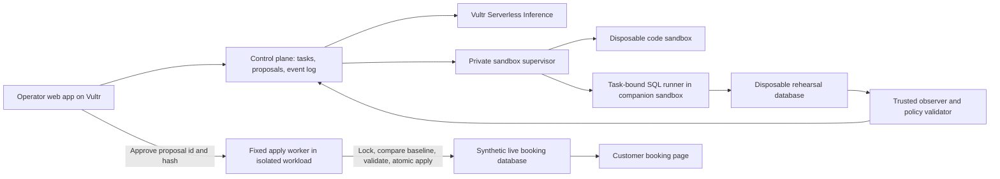

> **Historical booking-recovery decision, superseded after the user requested a stronger main-challenge project.** The current project is [Airlock in 35](35-AIRLOCK-MAIN-CHALLENGE.md). This document preserves the earlier analysis; it is not the current build scope.

# Build Dress Rehearsal — recover the booking, protect the customer

**Decision: 26 September 2026.** This is the current product and build brief. It supersedes the project choice and scope in 00, 11–19, 25 and 27. Those documents remain historical research, not a second active implementation plan. The detailed supporting reviews are [GPT-6 Astra's critique](28-astra-devils-advocate.md), [product/demo challenge](29-product-and-demo-challenge.md), [architecture and experiments](30-architecture-feasibility.md), and [fresh source checks](32-source-checks-and-decision-record.md).

**Recommendation:** build **Dress Rehearsal**, with **booking recovery** as its first working workflow. An AI agent repairs expired reservation holds on a disposable copy, shows the executed result, and produces an approval-bound change. A fixed executor applies that exact supported change only if the live demo application's relevant state has not changed. The customer can then book the recovered slot.

**Pitch:** “Let the agent fix the problem on a copy. See what changed. Approve it. If the world changed in between, rehearse again.”

This is our strongest buildable choice from the reviewed alternatives, not a promise of winning. The product is **not built or deployed yet**. Local database feasibility probes have passed; cloud execution and model behavior remain unverified. Default staffing assumption: two builders, with a four-person split below if available.

## 1. The actual product

The user is an on-call engineer or technical operator responsible for a booking application. A failed expiry worker has left old reservation holds marked `held`. Availability is derived from `held` reservations and confirmed bookings, so the site appears sold out even though some holds should have been released.

The operator submits: **“Recover expired holds for tonight's workshop. Preserve active reservations and confirmed bookings.”** A trusted form selects the resource; the server fixes the cutoff from the consistent snapshot clock, never a model-supplied future timestamp; free text does not redefine authorization. The agent inspects the rehearsal schema/data, writes and runs repair code, reads its output, and corrects execution errors within a bounded retry budget. The result is measured by a trusted observer. The operator sees specific hold IDs and before/after status, approves, and watches availability update in the running booking app.

This recovers the current backlog; it does not repair the stopped expiry worker. Show that remaining root-cause work explicitly.

Only one effect is promotable in v1: **`held → released` for an explicitly listed, eligible hold**. No deletes, refunds, emails, shell replay, schema migrations, capacity changes, or arbitrary SQL reach the live app.

This is a real running app using synthetic data. “Live” means the persistent demonstration application, **not a real company's production system**. All agent execution stays in a separate Vultr sandbox; the human-triggered fixed apply worker is also isolated from the web application process.

## 2. The demo everybody can understand

Use a deliberately small visible fixture:

- Capacity: three seats. Three holds occupy them: two expired, one still valid. Availability is zero.
- Rehearsal releases the two expired holds. The preview shows two seats available; the live app still shows zero.
- A judge clicks **Renew my reservation** for one of the previously expired holds. Its new expiry is in the future.
- The operator attempts the old approval. The system rejects the **entire** stale change; zero holds are released.
- Rehearse again. Only the remaining expired hold is released. Approve that new result.
- A customer books the recovered seat. Reload the page and show the persisted confirmation. The renewed reservation is still intact.

These numbers are the designed fixture, not achieved product metrics. Every displayed result must come from stored state, not a hardcoded animation.

### Three-minute stage script

| Time | Screen and action | Spoken point |
|---|---|---|
| 0:00–0:15 | Customer sees Sold out; operator sees expired holds | “The expiry worker failed. Customers can't book. We want an agent to fix this without taking someone's reservation.” |
| 0:15–0:45 | Run a live Vultr inference request; stream inspect → generated code → actual execution → measured diff | “It works on its own disposable copy. Those two seats are recovered there; the live app is unchanged.” |
| 0:45–1:00 | Judge renews one hold; click old approval | “You changed the facts. The old approval is now invalid. Nothing was applied.” |
| 1:00–1:35 | Fresh rehearsal, new one-hold proposal, approval, customer books | “Now it frees only the abandoned reservation. You can actually book.” |
| 1:35–2:00 | Separate labelled stress fixture runs an infinite loop in its sandbox; deadline terminates it | “This is actual execution, so we contain it. The supervisor ended this run; the booking service stayed up.” |
| 2:00–2:25 | Show supervisor lifecycle evidence and saved receipt, then reload booking | “Vultr runs the control plane, inference and isolated execution. The receipt binds the approved change to this result.” |
| 2:25–2:50 | One architecture view and one honest limit | “Our first adapter supports reservation release. Platform teams can add bounded repair adapters; we don't claim arbitrary production changes are safe.” |
| 2:50–3:00 | End on confirmed booking and preserved reservation | “Availability is recovered, and the customer's reservation survived.” |

**Latency target, not a measurement:** each model-assisted rehearsal should finish within 25 seconds on stage. Use a pre-created clean sandbox if setup is slow and label it as pre-created. If the model stalls, switch to a clearly labelled recorded agent trace executing on a fresh copy; say the trace was recorded. This is an operational fallback, not a replacement for demonstrating a functioning live agent before submission.

**60-second submission video:** 0–8 problem, 8–24 actual agent execution/diff, 24–36 approval and persisted booking, 36–50 contained timeout plus healthy live app and destroyed task, 50–60 architecture/receipt. The stale-approval interaction belongs in the longer demo unless the recording comfortably fits it. Record actual product behavior; no animated placeholder counts as execution.

## 3. Why this is the pick

| Candidate | Useful outcome | Stage strength | Primary weakness | Decision |
|---|---|---|---|---|
| **Dress Rehearsal: booking recovery** | Restores bookable inventory and completes a booking | A judge changes the facts; the product refuses stale approval and then succeeds | Can look like a cron fix unless we clearly demonstrate the general rehearsal/approval boundary | **Build the bounded version** |
| Repro Receipts | Runs a bug reproduction and returns evidence | Strong technical artifact and prior local experiments | Less immediately relatable; CI/triage comparison takes time to explain | Keep as a separate fallback concept, not a second simultaneous build |
| Try Before You Trust | Runs unfamiliar software in an isolated preview | Relatable developer fear and visible preview | Dynamic-analysis prior art, install/network variance, preview plumbing | Do not build this weekend |
| Broad Dress Rehearsal VM twin | Attempts generic operations on a production clone | Impressive cloud story if everything works | Secrets in clones, ambiguous side effects, row-drift bugs, root trust, boot timing, excessive scope | Rejected scope |

These are qualitative engineering/product judgments, not judge scores. The actual judge roster is not confirmed. The earlier simulated panels are brainstorming aids only.

The official challenge requires executed work, a Vultr backend and inference, isolated execution, and a containment moment. The chosen flow makes those requirements part of the product, rather than adding a security page at the end. [Organizer challenge](https://docs.google.com/document/d/1cca0kJZSraBDNfE_gFCRovpgRnlD2m613WLebd2ApN4/edit).

Database branches and previews already exist. Neon even documents agent checkpoints and promotion workflows. Our proposed distinction is the **small enforced change contract spanning execution, approval, stale-state refusal, and completion**, not “we invented a database twin.” [Neon branching workflows](https://neon.com/branching).

## 4. The architecture to build

Use React/Vite for a single operator page and booking view, a small TypeScript HTTP service with SSE, PostgreSQL for durable state, and a private supervisor on a second Vultr VM. Prefer a familiar HTTP framework over introducing a new agent framework. Use direct OpenAI-compatible chat completions against Vultr, with model selection determined by a successful live probe. Do not inherit old model names as verified current choices.

The agent runs generated code only in a per-task unprivileged container, preferably gVisor if verified. Resource limits, timeout and teardown are supervisor responsibilities. The public API has no Docker socket. The sandbox has no cloud keys, live DB credentials, metadata access or general outbound internet. SQL is a separate model tool dispatched by the supervisor into a trusted companion sandbox; generated Python has no direct database network connection. The runner is task-bound by supervisor identity/transport and uses a restricted database role through peer authentication; no bearer secret is handed to generated code. The database server, data directory, policy verifier and receipt store remain outside agent-writable paths. Deny DDL, role creation, filesystem/program access and extension loading in the rehearsal role.

Detailed transport and Linux enforcement must pass the deployment tests in 30. A diagram is not evidence that those boundaries work.

### The promotion contract

1. Verify the supported schema: no user triggers, rewrite rules, cascading writes, extensions or external side effects in the supported path. Fingerprint the relevant schema/catalog definition, not just a version string. Capture the relevant resource, hold and booking rows from one consistent database snapshot. Restore the rehearsal from those same rows and compute its baseline fingerprint from that exact snapshot.
2. Bind `target_id`, actual supported-schema fingerprint plus adapter version, trusted resource scope, fixed cutoff, baseline hash, canonical effects, proposal expiry and unique proposal ID into the approval hash. Trusted server code constructs this object; model prose is not the policy.
3. Stop agent writes and close outstanding rehearsal sessions before the observer reads the result. Reject unsupported column/table changes and any effect outside the release adapter. Validate every released hold against the trusted baseline and cutoff; do not trust the agent's claim that a hold is expired.
4. On human approval, lock the proposal and relevant tables in a fixed order, with short lock and statement timeouts. Read the current baseline **after acquiring locks**. Recheck the actual supported schema under those locks. For this tiny fixture, compare full relevant-table fingerprints, including new rows and capacity changes.
5. Any drift, expiry, hash mismatch, missing row, unsupported effect or failed business invariant causes **zero application writes**. A stale proposal requires a new rehearsal and a new approval.
6. Execute fixed parameterized updates to the listed hold IDs, verify exact affected-row counts and resulting availability, and commit effects plus the idempotency receipt atomically. Never execute the agent's shell or SQL against the live application.
7. A duplicate approval returns the existing result. A crash with an uncertain outcome triggers reconciliation by proposal ID; it does not replay a write blindly. Store the definitive apply result alongside the target transaction, then mirror status to the control plane.

Full-table comparison and write-conflicting locks are an intentionally conservative small-fixture strategy. It can reject unrelated changes and does not scale unchanged to a busy multi-tenant database. Table locks cover ordinary concurrent inserts/updates that per-row comparisons can miss. [PostgreSQL locking documentation](https://www.postgresql.org/docs/17/explicit-locking.html).

## 5. OpenBot and OpenMuse: exactly what to use

| Reference | Adopt | Change for this product |
|---|---|---|
| OpenMuse `apps/server/src/actions.ts`, `db.ts` | Hashed proposal, expiry, atomic claim, explicit succeeded/failed/unknown outcomes | Bind approval to the actual measured effects and snapshot; commit the apply receipt with target changes |
| OpenMuse `apps/server/src/engine/worker.ts` | Task leases, guarded steps, checkpoint state | No blind retry of uncertain writes; fence old workers and revoke their sandbox access |
| OpenBot `supervisor/src/docker.ts` | Narrow supervisor lifecycle and container hardening patterns | Per-task identity/lifetime, compulsory limits, default-deny network, no public supervisor |
| OpenBot `server/src/computer/policy.ts`, `gateway.ts` | Deny-before-allow policy and audit-before-action structure | Small typed policy; no default allow-everything and no browser-owned execution |
| Both products' interaction ideas | Clear task, execution and approval states | One useful repair flow; no chat workspace, desktop client, mail/calendar, or mobile app |

Use the pinned versions in 07/08 and preserve MIT notices for any code actually copied. State which parts are adapted code versus architectural inspiration. **Do not fork either complete app:** their inspected versions require CopilotKit Intelligence, add unrelated features, and carry boundary assumptions we do not want. GPT-6 Astra is used for development-time critique only; product agent calls must use Vultr Inference.

## 6. Evidence and the remaining gates

Local research probes used temporary synthetic databases, not a deployed product. PostgreSQL 17.11 passed 11 assertions covering release then booking, renewal/new-row/capacity drift refusal, interrupted-batch rollback, retry after rollback, concurrent approval deduplication, conflicting-writer exclusion, fresh rehearsal preserving a renewed hold, and restricted-role denials. Eight concurrent apply connections produced one application and seven existing-result responses. A smaller SQLite probe also exercised proposal metadata checks. See 30 for exact coverage and raw-result references; do not treat checks from one probe as checks of the other.

The measured median of roughly 13 ms across ten tiny local PostgreSQL apply runs includes local CLI startup. **It is not cloud latency, model latency, sandbox startup, or a scalability benchmark.** These are disposable feasibility implementations; their security configuration is not production-ready and they are not submission code.

| Gate | Deadline relative to build start | Pass evidence | If it fails |
|---|---|---|---|
| Vultr inference | +45 min | Real parsed tool call and result round-trip, then inspect/execute workflow | Debug access/provider immediately; recorded traces alone do not satisfy the finished product |
| Isolated runner | +90 min | Generated code runs outside API; credentials/metadata inaccessible; timeout and teardown proven | Simplify to supported container isolation on a separate VM; do not pretend unverified microVM support works |
| Headless useful path | +3 h | Clone → execute → trusted diff → approve → persistent booking, on Vultr | One focused hour to repair; if still fundamentally incomplete at +4 h, switch early to the curated Repro Receipts path or explicitly abandon the apply claim |
| Correctness | +4 h | Whole stale batch refusal, schema validation, phantom/capacity drift, rollback and duplicate approval pass on deployed PG | Maximum one further repair hour; unresolved central correctness at +5 h kills promotion for this submission. No UI workaround or partial apply |
| Agent capability | +6 h | Live model solves at least three input variants; outputs and errors shown; expected valid holds preserved | Tighten schema guidance/tools, retain genuine code generation; never replace it with a hidden hardcoded repair |
| Complete public flow | +10 h | Public URL, real execution, booking, timeout containment and teardown | Freeze features; complete missing required pieces |
| Reliability | Final 4 h | Ten consecutive rehearsals, at least three variants, recording made, setup docs tested | Fix failures, cut extra presentation beats; disclose replay if used |

A late-night switch to an unrelated product is not a credible fallback. The +4/+5-hour cutoffs are deliberately early; after those, do not keep a failed promotion implementation alive behind a polished UI.

Ten runs and three variants are release targets, **not current results**. A known-schema repair is technically a deterministic job; the LLM contributes diagnosis, schema inspection and code authoring from a ticket. The trusted adapter provides the safety boundary. Do not claim an LLM is necessary just to expire a known hold.

## 7. Build ownership and ruthless scope

For two people: **A** owns Vultr, inference, runner, SQL broker and teardown. **B** owns the booking fixture, transaction/approval contract, observer and two-page UI. Pair on the headless path and trust boundary before either polishes visuals. Target roughly 30–40 person-hours including integration and demo work; this is an estimate, not measured delivery capacity.

For four people: A infrastructure/sandbox; B database and approval contract; C agent/broker/streaming; D frontend/demo/validation. Give every interface a tiny example payload in the first hour and integrate by hour three. For solo, this product is high risk and is not the recommended scope: choose the already-researched curated Repro Receipts path before investing in a new apply engine, unless a deployed headless recovery loop is already proven. That fallback still needs its own Vultr agent/sandbox/UI work; it is not an instant pivot. If team capacity or early gates force that choice, explicitly adopt one plan and stop the other.

**Must ship:** working booking app, disposable rehearsal, live Vultr code-generating loop, measured diff, human approval, atomic typed apply with stale rejection, persistent booking, timeout containment, teardown, public app, setup/architecture/attribution docs and video.

**Cut:** full VM snapshots, production cloning, root agents, generic differ, files/cloud APIs, rollback button, autonomous refunds, multiple agents in the runtime, safety classifier, vision loop, arbitrary repository/package installs, elaborate pricing, and multi-model comparisons. The research team can be multi-agent; the product needs one bounded agent loop.

**NetBird:** only add it after the complete core is green and a separate owner can show the required access and lifecycle behavior. Keep it off the core build's critical path. Do not claim the bonus from a diagram or a static password page. See the organizer bonus doc and 14 for its separate requirements.

## 8. Applying the user's hackathon guide

| Chan principle | Our concrete execution |
|---|---|
| Strong team with distinct roles | Explicit infrastructure/contract/agent/UI ownership; pair on integration early |
| Understand judges | Technical judge gets transactions and containment; sponsor gets genuine Vultr execution; business judge sees an incident resolved and customer booking; do not invent who is on the panel |
| One or two primary features | Rehearse-and-approve; stale-change refusal. Containment is execution evidence, not a separate product |
| Design for first impression | Start on the sold-out booking page; show side-by-side live/rehearsal states and one clear approval card |
| Validate before and after | Short operator interviews before coding, then show the running flow to the same people; record only actual responses |
| Interactive presentation | One judge renews a hold; no arbitrary public prompt queue or unbounded live input |
| Rehearse the demo | Three-minute story, separate 60-second recording, timed fallbacks and persisted-state proof |

Do not adopt prototype-only advice: the user explicitly requires working software and the event requires actual execution.

### Validation and business hypothesis

First buyer hypothesis: a small SaaS platform/operations team already supervising agent-authored maintenance changes. First acquisition hypothesis: install the narrow open-source adapter in one consenting team's synthetic staging environment, validate incident workflow, then consider paid managed audit/policy/runner hosting. Both are hypotheses; there are no new customer interviews or willingness-to-pay results in this pass.

Ask three operators: “Tell me about your last manual data repair”; “How did you decide it was safe?”; “What changed between review and execution?”; “What would stop you using this?” After showing the product, ask them to name a real supported incident they would trial it on. Keep response notes and actual sample size. Do not send outreach without user authorization.

Do not quote invented revenue saved or inflated market size. The demo's business evidence is a completed synthetic booking; its market promise remains to be validated.

## 9. Answers to the hard questions

**Isn't this staging?** A disposable copy is established technology. The contribution is a measured supported change that is bound to approval, rejected when the relevant baseline changes, and applied by a fixed executor. The judge interaction demonstrates that boundary.

**Isn't this a cron job?** For this known defect, a cron fix is appropriate. The demo is a small proof of a controlled repair workflow for agent-authored changes. We have not built a universal incident responder.

**What if the model deletes everything?** Its SQL role and sandbox limits constrain rehearsal. Unsupported changes cannot become an approved release contract. The trusted observer/policy/apply code does not accept a model-generated success message as evidence.

**Does the receipt prove safety?** No. It records provenance, the approved contract and the committed outcome within a trusted control plane. It is not independent proof against a compromised host.

**Why not partial apply?** A related row or renewed hold can invalidate the original reasoning. For this adapter we abort the entire batch and request a new rehearsal.

**Does it handle a busy production database?** Not yet. Full-table fingerprints and short write-blocking locks are appropriate for our small fixture, not a claim of high-throughput production support. Generalization needs adapter-specific conflict/read-set design and deployment hardening.

**What did you build at the event?** List actual event-built files/features and reused libraries honestly. Keep this pre-event research and temporary feasibility code distinguished from the submission implementation. Never claim an unbuilt component is complete.

## 10. Submission discipline

Use the conservative existing schedule: build begins Sat Sep 26 11:30 PDT / Sun Sep 27 00:00 IST; target submission Sun Sep 27 11:30 PDT / Mon Sep 28 00:00 IST, ahead of the noon PDT cutoff in the participant-guide capture. Confirm organizer updates at kickoff. Later platform availability is not extra build time.

Before submission: public Vultr URL, live inference proof, recorded containment, public repository with secrets excluded, reproducible setup, architecture and trust limits, original-versus-reused attribution, actual validation/test counts, and the short video. Keep the deployed judge service available. The final screen should be **a confirmed booking and a preserved reservation**.
