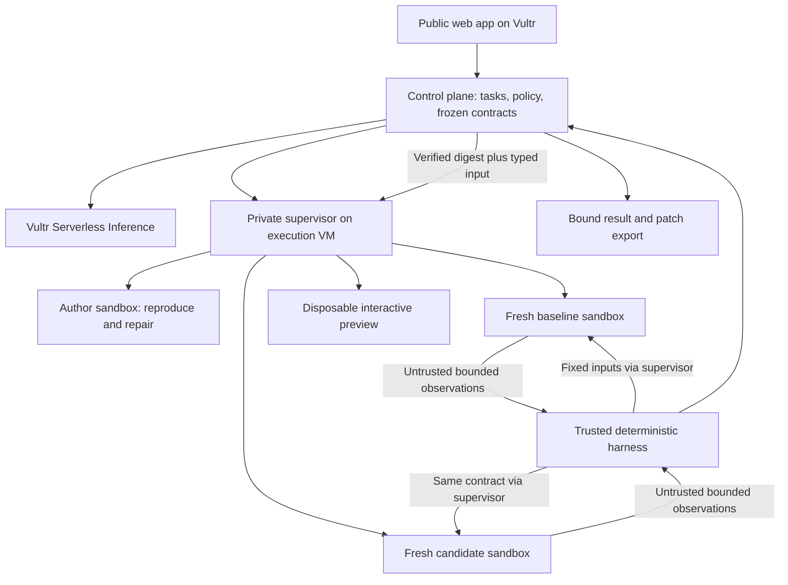

# Airlock — turn an untrusted bug report into a tested patch

**Current project decision, 26 September 2026.** This supersedes the booking-recovery proposal in 31 and the broad sandbox-workspace description in chat. It is a research-backed build specification, not an implemented product. Read [34](34-main-challenge-evidence-and-decision.md) for evidence, alternatives and the review team's disagreement.

**Detailed implementation architecture:** [37 — OpenMuse/OpenBot architecture](37-AIRLOCK-OPENMUSE-OPENBOT-ARCHITECTURE.md), based on fresh source audits in 36a–36c. It refines the architecture/reuse details here: OpenMuse worker/store plus offline-computer checks, OpenBot's narrow supervisor, a new token-free execution bridge, an external comparator, and immutable artifacts.

**Kickoff amendments:** [38 — kickoff decks and NetBird clarification](38-kickoff-decks-and-netbird-clarification.md) records Vultr's kickoff slides and the organizers' NetBird clarification and amends this file in five places: the isolation runtime (§5), the containment moment (§7), five-checkpoint run records, the recommended shape of the optional NetBird add-on (§10), and the build gates' hour targets made explicitly soft (§9). Where this file and 38 differ, 38 is current.

**Build Airlock: a web agent that takes a supported bug report, reproduces the failure in quarantine, attempts a minimal repair, and returns a patch plus independently measured before/after behavior.** Every piece of unfamiliar or generated code executes in disposable Vultr sandboxes. The agent can edit the candidate; it cannot edit the acceptance contract, grant itself privileges, publish its work, or decide that it passed.

**Pitch:** “Give the agent the bug. Get back a patch you can try, with the checks it actually passed. Its code runs on disposable Vultr machines, away from your laptop and credentials.”

The main challenge is safe **execution of useful work**. Our useful work is bug reproduction and repair. The engineering problem is that both the submitted code and the agent's output must be treated as untrusted. Our execution boundary protects the system; our separate acceptance checks protect the result from self-reported success.

## 1. The person, problem and deliverable

A maintainer or SDK engineer receives a report: “This input crashes your library. Run this to see it.” Before fixing it, they must reproduce it, build the right environment and inspect unfamiliar code. Delegating to a coding agent still leaves two questions: what could that code touch, and did the agent actually fix the behavior?

Airlock performs that work for the supported environment. The successful deliverable is:

- a minimal source patch, tied to its exact base commit;
- a runnable reproduction and frozen input/expected-output contract;
- a table of observations on original code and candidate code, including regression cases;
- an interactive example running the same frozen candidate;
- the execution log, environment/version hashes and sandbox lifecycle record.

The person can try the result and download the patch. Nothing merges, posts to GitHub, or deploys to production automatically. A failed repair still returns the reproducible failure and a clear unresolved status. It never becomes a green result because the model sounded confident.

## 2. Exact first demo: fix a real report-export crash

Use [python-tabulate issue #365](https://github.com/astanin/python-tabulate/issues/365), a real report about empty tables with `maxheadercolwidths`. The existing local lab in [22](22-feasibility-lab.md) reproduced failure at one pinned revision and passing behavior at a later revision.

Build a small trusted **Report Export** interaction: choose empty data or a small table, select a header width, and render/download a plain-text report. It calls the real library. At the chosen old revision the empty input crashes. The agent's task is to fix that library behavior while preserving normal table formatting.

This is an explicitly labelled **historical issue replay**, not a newly discovered bug, a live customer's outage, or an evaluation of unseen problems. The wrapper is the visual demonstration of the real library call. Do not imply it is an arbitrary generated web application.

Pinned local-lab references:

| Role | Revision | How used |
|---|---|---|
| Broken source | `e13a4d0dd292cade200e653eb9155a1ca0f1dbea` | Agent's initial source; baseline execution |
| Known later passing source | `87a9a4e07a5efb39b81fdb6ac513b1d345bb21fb` | Maintainer reference for designing/validating the exercise, never supplied to the repair agent |

Do not fetch today's HEAD during the stage demo. Do not claim the current issue status from a cached page. The task is to repair the explicitly pinned old revision. Supply no `.git` history, upstream patch, later checkout or gold diff to the agent. Historical model memorization remains possible, so this is a product demonstration, not a benchmark claim.

The visible payoff: **the same report export that crashed now succeeds, and an ordinary non-empty report still works.** A judge can change the header text and width within the supported form and try the patched code.

## 3. The complete agent workflow

1. **Open the case.** Select the supported repository/runtime and paste the issue text or select the documented historical case. Reject unsupported repository/runtime combinations explicitly. The v1 UI must not promise “any GitHub repo.”
2. **Reproduce.** Vultr Inference plans the investigation. Tools read source, write a reproduction and execute it in a disposable author sandbox. Real stderr returns to the model for bounded correction.
3. **Freeze the acceptance contract.** The model may suggest reproduction inputs, but trusted code validates the schema. A maintainer-provided/approved contract fixes the expected behavior and regression cases before repair. The demo contract is event-authored and disclosed. Test specifications live outside the author environment.
4. **Confirm the baseline.** An external deterministic harness sends the fixed typed inputs to a fresh original-code sandbox. The expected reported failure must be observed; otherwise return not reproduced or inconclusive, not “fixed.”
5. **Repair.** The agent edits supported source files, executes its own checks and retries within the task budget. Its local test output remains advisory.
6. **Freeze the candidate.** Stop the author process and descendants, deny new dispatch, then capture regular allowlisted source files with bounded lengths and canonical hashes. No symlinks, special files, traversal paths, arbitrary archives or runtime configuration changes enter the candidate bundle.
7. **Verify independently.** Reconstruct the candidate from a pristine base plus those source changes in a fresh sandbox. The trusted harness repeats the frozen behavioral checks without importing candidate code or accepting candidate test counts. All required checks must complete; errors and timeouts cannot become passes.
8. **Try and export.** The trusted UI renders escaped text returned by a fresh invocation of the verified candidate. Preview, patch and result all reference the exact same candidate digest. A human clicks Export; the server returns the bound patch/reproducer/report bundle.
9. **Dispose.** Destroy author and verification environments after their phases. Any interactive preview gets an explicit short TTL and an End session control; revoke dispatch when expired, then destroy its environment. A janitor handles abandoned tasks. Durable evidence survives without keeping a runnable sandbox alive.

MVP terminal states: `NOT_REPRODUCED`, `REPRODUCED_UNRESOLVED`, `CANDIDATE_PASSED_CHECKS`, `CHECKS_FAILED`, `INCONCLUSIVE`, `STOPPED_LIMIT`. “Passed checks” does not mean generally correct, secure or safe to merge. Human review remains required.

## 4. The central technical contribution

**The component doing the work cannot grade or release its own output.**

That requires more than a second model reading a transcript or a fresh container running the agent's pytest tree. Candidate Python can interfere with pytest when both share an interpreter. Airlock's trusted comparator stays outside the candidate environment and compares actual returned values to the frozen contract.

For this library adapter, use a supervisor-invoked fixed JSON-in/text-out entry point. The adapter and candidate library execute together inside the untrusted sandbox; their returned values are untrusted observations. The external harness owns expected outputs, expected case IDs, coverage/completion counts and pass/fail decisions. The supervisor owns exit/signal/time-limit metadata. An output field named `passed`, a forged JUnit file, or a line saying “all tests passed” has no authority.

A candidate can still overfit the finite checks or behave differently elsewhere. The receipt states precisely which inputs and comparisons passed. It is provenance within our trusted service, not an independent security certification. Hashes bind bytes; they do not establish program correctness.

## 5. Architecture: small enough to build, clear enough to defend

**VM A:** React/Vite frontend, a small TypeScript HTTP/SSE API, durable task/receipt store, Vultr model client and deterministic result comparator. It never executes candidate Python. Provider credentials stay here. All result/log content is parsed and escaped as untrusted data.

**VM B:** a private narrow supervisor owns container authority. It creates/executes/freezes/destroys task sandboxes and retrieves bounded files/results. It accepts authenticated controller calls with server-owned IDs, not arbitrary Docker options. Each container runs as non-root with dropped capabilities, no-new-privileges, memory/CPU/PID/wall-clock limits, read-only runtime and an isolated writable task directory. The runtime is an inspected, recorded tier (38 §3.1): gVisor (`runsc`) is the floor and a Kata microVM runtime on a VX1 host is the target; a plain runc container is not an acceptable runtime. The supervisor inspects the effective runtime before every dispatch and writes it, with the guest kernel string, into the verification record. The product records its tier; it never claims one it did not inspect.

**Network and dependencies:** no outbound network for author, baseline, candidate or preview containers. Prebuild the supported Python runtime and dependencies from pinned sources. Do not install arbitrary issue-supplied packages or run setup code on the control plane. Curated package/source preparation is explicit deployment work; broader repository setup is a future isolated preparation service, not a hidden host-side `pip install`.

**Preview:** a trusted page calls a typed supervisor operation, then renders bounded plain text/JSON. It does not serve candidate HTML or JavaScript on the app's origin, need arbitrary port forwarding, or give the candidate a browser session. Rate-limit preview calls and bind them to the immutable tested digest. This is an interactive repaired-library preview, not generic website deployment.

**Containment:** an untrusted process can wreck its own writable workspace; it has no host mount, Docker socket, cloud metadata route, live database, model key or other task's files. Prove the actual deployed restrictions. A separate VM reduces consequences but does not establish that kernel exploits or side channels are impossible.

## 6. Use OpenBot and OpenMuse selectively

| Source | Adopt | Adapt |
|---|---|---|
| OpenBot supervisor and Docker configuration | Narrow lifecycle API and hardening structure | Per-task environment, mandatory limits, network none, no broad Docker passthrough |
| OpenBot policy/gateway | Deny-before-allow, audit before dispatch, server-resolved resource references | Tiny typed policy and bounded operations; reject allow-all defaults |
| OpenMuse task worker/store | Durable task states, lease/claim, checkpoints and cancellation | Supervisor fencing so cancelled or expired workers cannot continue writing |
| OpenMuse offline computer | Effective container inspection and confirmed-stop quarantine | Move these behind the execution supervisor; add runtime checks, task-attempt identity and remote request fencing |
| OpenMuse actions | Content binding, expiry and stale-reference rejection | Bind user export to exact candidate, evidence and base commit; use a repeatable authorized download, not the email/calendar transaction lifecycle |

Pinned source audits are [07](07-openbot-audit.md) and [08](08-openmuse-audit.md), with focused integration audits in [36a](36a-openmuse-control-plane.md), [36b](36b-openbot-execution-plane.md) and [36c](36c-architecture-adversarial-review.md). Their audited complete applications bring unnecessary features and required Intelligence dependencies; adapt the specific modules in [37](37-AIRLOCK-OPENMUSE-OPENBOT-ARCHITECTURE.md) and preserve notices for copied code. Do not spend the event integrating both entire applications. GPT-6 Astra is the development reviewer, not the runtime agent provider: runtime model calls go through Vultr Inference.

## 7. The three-minute demo

| Time | Show | What the judge learns |
|---|---|---|
| 0:00–0:20 | Empty report export crashes. Show real issue link and historical base revision. | A real reproducible problem, clearly bounded |
| 0:20–1:05 | Start case: model plan, actual reproduction, source edit and execution events. | The agent performs work rather than describes it |
| 1:05–1:30 | Fresh baseline vs candidate observations; regression checks complete. | The worker cannot declare itself successful |
| 1:30–1:55 | Try the patched report, change a header/width, download the patch. | The result is usable and persists as an artifact |
| 1:55–2:20 | A judge types `rm -rf /` (or a fork bomb, or a metadata `curl`) into the Hostile input panel. The blast-radius card shows what died (that sandbox, its runtime and guest kernel) and what survived (control plane, supervisor, the other task, the host sentinel), then the destroy event and "(no sandboxes)". Healthy report interaction remains available. | The literal answer to "if I paste `rm -rf /`, what dies?"; the supervisor disposes of the sandbox |
| 2:20–2:40 | Optional negative control: broken source plus fabricated “tests passed” log is rejected by external checks. | The result comes from observed behavior, not the agent's story |
| 2:40–3:00 | One trust-boundary diagram, result digest and destroyed-task record; close on working report. | Vultr runs the control plane, inference and execution; scoped claim is reviewable |

Times are targets. Keep all beats; the forged-log negative control is Airlock's most distinctive one. Do not wait for the model to spontaneously misbehave; label the containment/false-log fixtures as controlled tests. A separately labelled runaway-timeout fixture remains available as a second containment beat. Do not induce a fake error just to show a retry; keep a genuine recorded error/retry if the live run succeeds immediately.

**60-second submission:** 0–8 crash, 8–27 real model/execution, 27–40 independent checks and working export, 40–53 hostile command absorbed by a disposable sandbox while the app stays healthy, 53–60 artifact/lifecycle (add the zero-inbound firewall views only if the NetBird add-on is done). Record actual deployed behavior. Prewarmed clean environments are fine if labelled; cached agent traces must be labelled recorded/replay. A live-agent requirement is not satisfied by a replay-only product.

## 8. Why this choice survives the research

| Alternative | Reason it is not the current product |
|---|---|
| Generic agent IDE/workbench | Sandbox, code execution, repair loops and QA already exist in OpenHands and others. It lacks a focused user job. |
| Booking recovery | Introduced a custom business app and delicate database promotion without using the strongest existing bug-report evidence. |
| Universal production twin | Cloned secrets, arbitrary effects, schema/trigger drift, rollback loss and slow cloud lifecycle undermine the promise. |
| Pure Repro Receipts | Strongest existing component evidence; retained as a valid unresolved outcome. Intended stage demo adds a useful patch, provided the live repair gate passes. |
| Browser submitter/handoff | Portal authentication and non-idempotent external effects complicate a 24-hour build; production duplicate evidence is weaker in this corpus. |
| Software/MCP detonation lab | Useful possibility, but arbitrary installs/preview and delayed behavior are unmeasured; a short run cannot certify safety. |
| Attack wall or isolation ladder | Shows infrastructure without finishing the user's job; creates build and demo scope. |

OpenHands and Astro already support issue repair and verification. The honest claim is **a focused, self-hosted hostile-input workflow with a demonstrated separation between execution, grading and release**, implemented on Vultr. Do not claim a new invention or assert that competitors lack safety controls. The comparative case is recorded in [34](34-main-challenge-evidence-and-decision.md).

The research team's product and engineering reviews support this narrow repro-to-repair scope. GPT-6 Astra supports it **conditionally** and still considers reproduction-only the evidence-backed default until live repair passes. That disagreement becomes a concrete build gate instead of an invented consensus score.

## 9. What is known, what must be built

**Existing evidence:** 22 reports 30 deterministic issue/ref pairs and successful hashed offline installs in a native macOS lab. Eight of ten curated reports behaved as expected; two illustrated ambiguity or intended behavior. The tabulate case failed before and passed after at pinned refs. Those repro scripts were hand-written. They were not model-generated patches, Linux containers or Vultr measurements.

**Not demonstrated:** live Vultr repair, external adapter/harness, cloud containment, interactive preview, concurrent task isolation, public app, or reliable end-to-end timing. The PostgreSQL booking tests in 30 do not validate this project. This pass adds design review and source checks, not a product benchmark.

### Build gates from the permitted hacking start

| Gate | Target | Decision |
|---|---|---|
| Inference + runner | +1 h | Real parsed Vultr tool call, limited code execution on Vultr, timeout and teardown. These are requirements for every variant. |
| Repair viability | +2 h | At least 2/3 fresh runs on the pinned tabulate task produce a source patch passing the frozen reported case and basic regression cases through a minimal trusted external comparator, without upstream fix access. Agent-local checks do not count; build that small comparator as part of this spike. If not, one focused hour to simplify prompt/tooling; at +3 h commit to reproduction-only for this submission and say so. |
| Trusted path | +4 h | Fresh base/candidate run through external comparator, frozen digest, patch export. Fake pass log cannot change verdict. No candidate code imported into verifier. |
| Public useful flow | +8 h | Public URL runs issue→execution→checks→interactive result→download without terminal rescue. |
| Safety and failure handling | +10 h | Independent time/memory limits, task-file isolation, no metadata/general network, cancellation fencing, output size caps, and no artifact mutation after verification. |
| Freeze | Final 6 h | Stop adding adapters; test reset/failure paths, record video, document limits and submit early. |

If the +3 h gate selects reproduction-only, disable repair/patch export in the public UI and replace candidate-preview requirements with a runnable reproduction bundle and original/reference version observations. Use the repro artifact as the demo payoff and say repair is unavailable. Rewrite the video and closing line accordingly; do not retain a “fixed” claim from this intended repair plan. This is an explicit reduced submission scope, not success on the original repair goal.

The 2/3 gate is an initial feasibility threshold, not production reliability. Before presenting, target ten fresh successful rehearsals on the deployed hero task and exercise at least three input variants. Report the actual count, failures and latency; do not convert repeated runs of one known bug into a general repair-success claim.

For two builders: A owns Vultr, model/tool loop, supervisor and runner; B owns the frozen contract, external verifier, artifact export and simple UI. Integrate the shared event/result payload during hour one. For three, split frontend/demo/validation into a dedicated role. For solo, reproduction-only is the default until the repair gate is already proven. All schedules are estimates; model and deployment gates decide scope.

### Tests tied to the central claim

- Broken base fails the reported case; repaired candidate passes it and normal-input checks.
- Empty/uncollected tests, malformed JSON, oversized output, launch failure and timeout cannot produce `CANDIDATE_PASSED_CHECKS`.
- Changing a local test, log or claimed pass count cannot change the external result.
- An unchanged broken candidate with a forged success log still fails.
- Snapshot bytes change after verification: preview/export refused unless a new candidate is verified.
- Patch export rejects out-of-scope files, symlinks and traversal; no generated extraction command runs on VM A.
- One task exceeding resource limits is terminated; another task and the control plane remain healthy.
- Cancelled/expired work loses dispatch authority; crashes do not leave unlimited sandboxes running.

## 10. Scope and the winning presentation

**Must build:** one supported runtime/repository, useful real agent execution, bounded repair attempt, independently observed baseline/candidate checks, reviewable patch/reproducer, working typed preview, resource containment, cleanup and public delivery.

**Cut:** universal repos, browser automation, production access, automatic PR/merge/deploy, generic agent SDK, multiple isolation tiers, screenshot-based grading, safety classifier model, cryptographic ceremony, public attack queue, arbitrary package installs and another business vertical. NetBird is optional only after the main flow works; do not make it a critical dependency or claim its bonus without its required evidence.

Apply the user's hackathon reference through one clear user job, a useful before/after result, a focused frontend, real validation and rehearsed timing. Ask actual maintainers whether a reproducible case plus a bounded checked patch changes their review decision; record their real answers. Existing desk research is not customer interviews. Initial buyer hypothesis is a paid SDK/platform-maintenance team; no revenue or willingness-to-pay evidence has been established.

The project should leave the judge remembering three facts: **it fixed a real reproducible behavior; the agent did not grade itself; unsafe execution stayed inside a disposable environment.**
