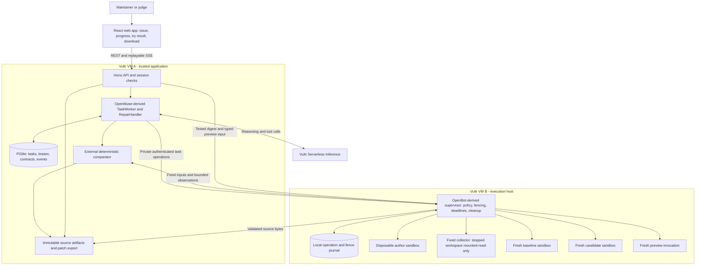

# Airlock: architecture from OpenMuse and OpenBot

**Decision, 26 September 2026. Design, not an implemented integration.** This is the detailed implementation architecture for [35 — Airlock / Repro-to-Repair](35-AIRLOCK-MAIN-CHALLENGE.md). It supersedes that document's abbreviated reuse table where more specific. Three source-audit workstreams informed it: [OpenMuse](36a-openmuse-control-plane.md), [OpenBot](36b-openbot-execution-plane.md), and [GPT-6 Astra's adversarial review](36c-architecture-adversarial-review.md). Amended by [38](38-kickoff-decks-and-netbird-clarification.md) after Vultr's kickoff decks: runtime tier (Kata on VX1 over a gVisor floor, inspected and recorded), the shape of the optional NetBird add-on, five-checkpoint run records, and a judge-typed hostile command as the containment moment.

## Start from the main challenge

The problem is **letting an agent perform useful work on untrusted code without giving that code control over the application, credentials or success criteria**. A chat interface around Docker does not finish that job. A repair agent that grades its own tests does not finish it either.

Build one product: **Airlock takes a supported bug report, reproduces it, attempts a minimal fix, and returns the exact patch with measured before/after behavior and an interactive example.** The initial supported environment is the historical python-tabulate report-export crash described in 35. This small scope makes actual execution, recovery, independent checking and artifact identity feasible to demonstrate together.

Use **one server-side reasoning agent**, with deterministic phase control around it. Research teammates and Astra helped design/review the system; they are not a runtime agent swarm. Every runtime model call goes through Vultr Serverless Inference. The external verifier is ordinary code, not a second model voting on the first model's work.

**Architecture decision: adapt OpenMuse's durable worker and store into the control plane; adapt OpenBot's small supervisor into the execution plane; add a task-specific verifier and immutable artifact pipeline.** OpenMuse's offline computer implementation also supplies stronger container-inspection and cancellation patterns to move behind the supervisor. Deploy a small new application containing these extracted modules. Neither complete upstream app is the composition root.

## Deployment and authority



The supervisor creates these roles as needed; they are not five permanently running services. The app VM never executes Python from the report or candidate and never receives a Docker socket. The execution supervisor holds Docker authority; task containers hold neither management credentials nor model keys.

| Component | Owns | Cannot delegate to the model |
|---|---|---|
| API / task controller | User identity, supported task profile, acceptance contract, phase, budget, export authorization | Authentication, success state, arbitrary repository/image selection |
| Repair agent | Proposed source changes, reproduction code and author checks | Runtime flags, credentials, frozen expectations, verdict, release |
| Supervisor | Task-to-container mapping, actual execution, operation acceptance, deadline, termination and cleanup | Docker options, mounts, host commands, network routes |
| External comparator | Required case IDs, expected behavior, comparisons and completion count | Verdict or coverage to stdout, pytest/JUnit, or agent narration |
| Artifact service | Canonical bytes, digests, diff against exact base, download identity | Artifact identity to agent-generated manifests or git output |

Two VMs are our recommended layout, not a statement that the challenge mandates two; Vultr's kickoff deck shows the same two-instance shape (control plane, sandbox host, private dispatch link), so treat it as the expected baseline rather than a differentiator (38 §2). The baseline trust model assumes the execution host/runtime remains intact: a full compromise of VM B could falsify observations from its containers. A separate verifier execution host is a later extension for that stronger threat model. Finite checks also do not establish general correctness.

## What we actually reuse

Audited pins: OpenMuse `205cc386b75aae1a862f3fdd43104b570c8d0911`; OpenBot `3c73cf00efba46122dfd0447485e2b61f1d6a2cd`. Paths in this table are inside the corresponding repository. Preserve MIT license notices and record copied files and modifications.

| Capability | Actual upstream source | Integration decision |
|---|---|---|
| Durable orchestration | OpenMuse `apps/server/src/engine/worker.ts` | Adapt `TaskWorker`, its injected `TaskHandler`, lease/CAS claim, heartbeat, checkpoint and event interfaces. Implement `RepairHandler` at that seam. |
| Task storage | OpenMuse `apps/server/src/db.ts` | Adapt Store's PostgreSQL-compatible operations. Use PGlite in one controller process; add typed immutable-artifact and append-only-event methods. Use Postgres if splitting API and worker later. SQLite is not a drop-in Store backend. |
| Guarded model tools | OpenMuse `apps/server/src/engine/model.ts` | Retain serial dispatch, schema validation, guard/checkpoint and tool-error feedback patterns. Replace its tool inventory and model-owned finish semantics. |
| Reviewed output identity | OpenMuse `apps/server/src/actions.ts` | Adapt content binding, expiry and idempotent proposal ideas into an artifact export grant. Do not carry Google email/calendar actions or uncertain external-write semantics into a repeatable download. |
| Sessions and task endpoints | OpenMuse `auth.ts`, `engine/routes.ts` | Adapt hashed session-token and task-route foundations. Upstream uses one `local-user`, so explicit judge/operator permissions and task ownership checks are new work. |
| Narrow privileged service | OpenBot `supervisor/src/index.ts`, `names.ts`, `docker.ts` | Fork standalone Bun/Hono + dockerode supervisor, derived resource names, ownership checks and lifecycle errors. Replace persistent per-bot computers with disposable task-attempt roles. |
| Offline container hardening | OpenMuse `apps/server/src/computer.ts` | Move/adapt create-and-inspect checks and stop/quarantine behavior **inside VM B's supervisor**. Preserve no-network/non-root/read-only/resource checks; change per-owner identity to per-attempt. Do not copy its app-local Docker access into VM A. |
| Shell and file tools | OpenBot `agent-computer/src/shell.ts`, `workspace.ts` | Borrow bounded result schemas and validation cases. Implement execution through the supervisor's container API. Do not import `createShell()` into a host service: it would spawn on that host. Strengthen file reads and collection bounds. |
| Policy before effects | OpenBot `server/src/computer/gateway.ts`, `policy.ts` | Retain resolve resource → enforce policy → record intent → dispatch ordering. Use a small typed task/phase registry; the full browser gateway is unnecessary. |

**New Airlock code:** `RepairHandler`, direct Vultr model client, supervisor execution/freeze protocol, generation fencing and operation journal, bounded regular-file collector, pristine candidate materializer, external comparator, artifact manifests/export, and task-specific UI.

OpenBot's upstream supervisor only exposes ensure/stop/reset/list; **it has no command-execution endpoint**. Its normal execution path uses a token-bearing networked `agent-computer` service. Adding a fixed supervisor-mediated runner is a real integration task, not a configuration switch.

Omit the full OpenMuse `createApp`/`AgentService`/conversation runtime and OpenBot app/bot/browser composition. They bring Google/personal-assistant/browser concerns and Intelligence dependencies irrelevant to this workflow. The extracted Store/worker and standalone supervisor do not need the full SaaS runtime. Build the UI around authoritative REST/SSE state; a model-editable AG-UI snapshot must never control verification or lifecycle status.

## The end-to-end run

1. **Create the case.** The user chooses the supported historical report and supplies issue text. The API validates input, creates a server-owned task ID and binds the pinned source/runtime. For the demo, the disclosed acceptance contract is prepared before repair; model-suggested new cases require maintainer acceptance before joining that contract.
2. **Reproduce in quarantine.** The worker leases the task and starts an author attempt. The agent reads source, writes a small reproduction, and executes it. Bounded real stdout/stderr return through the supervisor to the model. Errors trigger bounded correction rather than a fabricated successful response.
3. **Measure the original behavior.** The comparator sends the frozen typed cases to fresh baseline invocations. It verifies the expected original failure and ordinary regression behavior. If the target failure cannot be observed, stop with `NOT_REPRODUCED` or `INCONCLUSIVE`.
4. **Attempt the repair.** The agent edits allowlisted source and runs its own checks. Those checks inform the agent but have no authority over final status. Each attempt has a maximum model-call count, token budget and wall deadline.
5. **Seal the source.** The controller requests freeze. The supervisor persistently denies new dispatch, stops the entire author container and confirms both termination of all volume writers and completion/cancellation of outstanding executor requests. It never restarts this author container. A fixed isolated collector mounts that volume read-only, reads only allowed regular files, and sends a bounded file-byte envelope. The controller validates it and computes the candidate digest and diff against its pristine base.
6. **Verify the frozen candidate.** New sandboxes reconstruct the exact candidate from the trusted base plus the allowed file replacements. A fixed adapter receives typed input and returns bounded observations. The comparator, on VM A, owns assertions and required-case completion. Timeout, protocol error, incomplete output or unexpected process failure cannot pass.
7. **Try exactly that result.** The trusted Report Export form sends a new bounded input plus the verified digest. The supervisor starts a fresh candidate invocation. The UI renders escaped plain text; it does not run candidate JavaScript or serve candidate HTML on the application origin.
8. **Download and dispose.** A user click authorizes download of the exact patch, reproduction and check report. A retry downloads the same immutable artifact. Author, collector and check containers/volumes are deleted after use; preview authorization has its own expiry, while each preview invocation is short-lived. The supervisor janitor recovers abandoned resources.

Successful phase progression: `prepare → reproduce → baseline → repair → freeze → verify → ready`. These are controller phases, separate from worker status. Model `submit_candidate` advances only to freeze. Terminal outcome names remain those in 35, including `REPRODUCED_UNRESOLVED`, `CANDIDATE_PASSED_CHECKS`, `CHECKS_FAILED` and `STOPPED_LIMIT`.

## The execution bridge

`--network none` is deliberate for all task roles. Therefore **do not retain OpenBot's in-sandbox HTTP transport**. VM A calls a private authenticated supervisor on VM B; that supervisor starts a fixed runner through Docker exec with bounded stdin/stdout, or starts a fresh fixed one-shot container. Only the author operation permits a shell command, passed as data to a command executed inside that sandbox. No host shell interpolation, arbitrary proxy URL or Docker configuration is accepted.

Illustrative new supervisor contract:

```ts
type AttemptRef = { taskId: string; attemptId: string; generation: number };
type Operation = { operationId: string; requestDigest: string };

createAttempt(ref, operation, supportedProfile, absoluteDeadline);
authorTool(ref, operation, { kind: "read" | "write" | "exec", args });
freezeCandidate(ref, operation); // fixed profile owns file allowlist
invokeArtifact(ref, operation, { artifactDigest, caseInput });
revokeAttempt(ref, operation);
inspectAttempt(ref);
destroyAttempt(ref, operation);
```

These are **proposed**, not upstream APIs. IDs, profile and deadlines are supplied by the trusted controller; the model sees only author tools already bound to its attempt. Supervisor deployment configuration fixes runtime/image digests, permissible artifact profiles and caps. Candidate invocation cannot accept a caller-selected executable, mount or network.

The supervisor validates artifact envelopes/digests before reconstruction too; a controller digest in a URL is not a substitute for checking transferred bytes. It provisions pristine source and replacements using a fixed materializer, never by executing candidate install scripts, git hooks or shell patches. The first profile supports replacement of a small fixed set of Python files; adding/deleting files, binary patches and arbitrary repositories are outside v1.

An adapter running with candidate Python is still inside the untrusted environment. It is not the judge. Returned text/JSON and author logs are untrusted data. The supervisor supplies its own exit/timeout/termination observations; the comparator uses those plus the frozen expectations. Use a fresh one-shot sandbox per baseline/candidate case in v1 to avoid state carrying between cases. Image/layer caching can reduce startup overhead; latency must be measured.

### Runtime profile

Start with a pinned lean Python image and prebuilt dependencies, explicit non-root UID/GID, read-only runtime, private IPC/PID namespaces, capabilities dropped, no-new-privileges, no network or published ports, restart disabled, and a task-only writable workspace. No browser profile, SPIRE socket, Docker socket or credentials enter it. Inspect the **effective** configuration before dispatch, borrowing OpenMuse's fail-closed attachment checks.

Adapt those checks to the actual Python image: environment allowlist, executable paths, workspace ownership and cache locations must agree with the image. Replace OpenBot's browser/Bun-port healthcheck with this runner's readiness check. Add explicit runtime selection and inspection: the deployment profile names the runtime (`kata` on a VX1 host, else `runsc`), the supervisor checks the effective runtime on every container and reads `uname -r`/`hostname` from inside it, and both go into the verification record; upstream OpenMuse's inspected profile does not itself check the runtime. Do not weaken inspection to make an incompatible image start.

Initial engineering targets, subject to the deployment probe: 1 CPU, 512 MiB RAM, 64 PIDs, 30 seconds per author command, 64 KiB combined captured output, 5 minutes per author attempt, 2 repair attempts, 1 MiB per accepted source file and 4 MiB total candidate source changes. CPU share/caps do not bound total runtime; the supervisor enforces deadlines separately. These are proposed caps, not measured supported settings or performance claims.

Author workspaces use dedicated named volumes retained only through stopped-container collection. A tmpfs workspace would disappear at stop, so do not combine it with this freeze design. Provision and test a hard per-volume storage quota, plus host-wide admission and disk headroom; per-write limits do not constrain arbitrary shell writes. Quota mechanism and gVisor/runtime compatibility are deployment gates. Do not advertise those protections before measuring them. The control plane remains available when a task exhausts its allotted resources.

Runtime tier (38 §3.1): **Kata Containers on the VX1 sandbox host is the target**, because it gives each task container its own guest kernel while keeping the Docker API this supervisor is built on (dockerode, named volumes, `--network none`, resource flags, stopped-container collection); Microsandbox/libkrun would replace that control surface. **gVisor is the floor.** If Kata fails its deployment probe (no `/dev/kvm`, virtiofs volume or read-only collector-mount problems), ship gVisor and record it. A plain runc container is not an acceptable runtime for any task role, so there is no Docker-only fallback. The supervisor enforces its own deadline and kills the whole container; an in-container timeout or process-group kill alone cannot reliably remove all descendant processes.

## Cancellation, recovery and identity

PGlite is the controller's workflow authority; a small new durable SQLite journal on the Bun supervisor stores attempts, generations, operations and teardown state. This is a separate local execution journal, **not** a SQLite port of OpenMuse Store. No distributed transaction is assumed.

- Each operation ID binds an identical request digest. A duplicate with different arguments is rejected. A completed duplicate returns its recorded result; an ambiguous operation is reconciled, not blindly rerun.
- A worker's database lease does not stop remote code. Supervisor requests carry a generation and a short renewable execution authorization, capped by the absolute attempt deadline. Expiry/revocation closes dispatch and stops the old container. A newer attempt cannot inherit its writable volume.
- Guard the actual Docker side effect, not just request acceptance: serialize lifecycle decisions per attempt and recheck generation/revocation immediately before every start/exec after asynchronous preparation. Freeze orders revoke → stop → settle outstanding executors → re-inspect stopped → collect. An already accepted delayed request must not restart or execute in the container during collection.
- On cancellation, the controller first records `cancelling`, then requests revocation. The supervisor persists revocation and confirms termination. Only then can the UI say `stopped`. Failed teardown stays visible and blocks resource reuse. A late tool/model response cannot overwrite cancellation with success.
- On supervisor restart, reconcile the journal with owned labels and actual container state. Terminate unknown or expired workloads. A crash between intent and command acknowledgement yields `unknown/interrupted`, not an invented successful receipt or automatic re-execution.
- On controller restart, inspect outstanding operations. Continue from an already sealed artifact; discard an uncertain author workspace and start an explicit fresh attempt if budget permits.
- A janitor deletes terminal/expired containers and volumes. It tombstones attempt identities so a delayed `ensure` cannot resurrect a destroyed workspace. Author expiry and preview access expiry are separate lifetimes.

OpenMuse's `guard()`/AbortController and OpenBot's `stop`/`reset` are useful starting points, but neither combination supplies these guarantees unchanged. In particular, upstream OpenBot reset retains workspace storage.

## Artifact and verdict contracts

Use canonical serialization with explicit schema versions. Immutable record insertion rejects replacement; generic Store `put` is an upsert and cannot supply this invariant. Store source bytes as bounded content-addressed blobs and metadata in PGlite.

```text
SourceManifest = schemaVersion + baselineCommit + baselineTreeDigest
               + sorted(path, byteLength, sha256) replacements
CandidateDigest = SHA256(canonical SourceManifest)

VerificationRecord = candidateDigest + runtimeImageDigest + adapterDigest
                   + contractDigest + case observations + comparatorVersion
                   + actual execution metadata + outcome

ExportGrant = owner/session scope + candidateDigest + verificationRecordDigest
            + expiry + explicit user action
```

The collector rejects symlinks at every path component, hardlinks, special nodes, traversal, unexpected/duplicate paths, missing required files and excessive count/bytes. It streams capped reads; OpenBot's current read-file method reads the entire file before truncating, so it is not suitable unchanged. The collector uses a clean immutable interpreter with `python -I -S` (or an equivalent isolated launch), sanitized environment and a working directory outside the mounted candidate tree; it does not import candidate, user or site initialization code. Never unpack an untrusted tar archive onto a host or execute candidate Python to compute the host-side diff.

The external contract includes supported typed inputs, expected ordinary results and expected original failure behavior. Baseline and candidate code receive inputs, not the oracle file or gold patch. Source snapshots exclude `.git` and later fixed history. The agent may infer or memorize a historical fix; this is a disclosed historical replay, not a claim of solving unseen bugs.

Export authorization checks the exact candidate, committed verification record and current user scope. Do not reuse OpenMuse's action claim unchanged: it omits the approved hash from the atomic claim predicate and expects a task still running/waiting for approval. A completed repair can be exported through an artifact-bound grant without keeping the task running or asking for an extra chat approval. Download is a repeatable read, not an exactly-once external mutation.

The preview must use the same candidate **and** runtime/adapter profile recorded during verification. Never preview the latest mutable workspace. A candidate can overfit finite checks; label the result **Passed these checks**, not safe, certified or guaranteed correct.

## Minimal application layout

```text
apps/web/                         React/Vite task page and Report Export form
apps/control/
  api.ts                          Hono sessions, task endpoints, SSE, export
  repair-handler.ts               Deterministic phases around one model loop
  vultr-client.ts                 Serverless Inference only, normalized tools
  store/                          Adapted OpenMuse Store + typed repositories
  worker/                         Adapted OpenMuse TaskWorker
  verifier/                       Contract comparison, no candidate imports
  artifacts/                      Canonical manifests, diff, immutable storage
apps/supervisor/
  api.ts                          Adapted OpenBot narrow service
  runtime.ts                      Docker adapter + OpenMuse hardening checks
  operations.ts                   Fences, request digests and local journal
  lifecycle.ts                    Stop/freeze/destroy/reconciliation/janitor
packages/contracts/               Shared schemas, not secret/runtime config
runtime/python/
  Dockerfile                      Pinned supported runtime
  adapter.py                      Fixed JSON input / bounded output interface
  collector.py                    Fixed read-only bounded file-byte protocol
profiles/tabulate-365/             Base manifest and preapproved case contract
THIRD_PARTY_NOTICES.md             Copied source pins, licenses, modifications
```

Start with API and TaskWorker in one controller process. No Redis, Kubernetes, full conversation platform, browser pool or second reasoning agent is required. Supervisor state stays local to its host. Keep a direct Vultr chat-completions driver unless an upstream adapter passes a real tool-call round trip; OpenMuse's existing TanStack/provider path is not proven compatible merely because it accepts a base URL.

## Build gates and ownership

| Workstream | Deliverable | Meaningful acceptance condition |
|---|---|---|
| Control / OpenMuse | Durable task, Vultr tool loop, ordered events, session scope | Closing UI does not stop task; controller restart reconciles actual operation; user cannot alter phase/verdict through UI state |
| Execution / OpenBot | Fixed profile, private supervisor, actual exec, deadlines and deletion | Runtime inspection passes; background child dies on stop; expired ID cannot restart; altered flags fail attachment; task cannot exhaust host storage |
| Verifier / artifact | Frozen contract, stopped collection, pristine replay, same-digest export | Original fails as expected; candidate behavior compared externally; forged pass log has no authority; symlink/oversize candidate rejected |
| Product / demo | Issue → observed crash → repair → try input → download; containment moment | Real public deployed run with visible useful output; no prerecorded events presented as live; a judge-typed `rm -rf /` in the Hostile input panel produces a blast-radius card (what died, what survived, destroy event) while the app continues |

First prove a **vertical slice**, not four parallel frameworks: a fixed failing base and a known diagnostic candidate through create → exec → stop → collect → fresh compare → preview → export. A diagnostic patch is clearly labelled test data. Then replace it with an actual Vultr-driven repair and meet 35's live-repair gate (at least two successes in three fresh hero attempts with the external verifier). No native local test or static source audit counts as proof of Vultr deployment or isolation.

If the model repair gate fails, retain the same architecture for a useful reproduction result and visibly disable the repair promise. If containment, candidate identity or comparator isolation fails, the project has not met its central claim: fix that before adding features. Browser automation and NetBird bonus work follow only after the working code-execution path; neither is needed to make this repaired-library preview interactive.

## Demo payoff

The judge sees the old Report Export crash, watches actual agent edits and execution, then sees separately measured baseline/candidate results. They change a supported input and get output from the exact frozen candidate, then download its patch and evidence. A controlled runaway job hits its supervisor limit; the application remains usable and the job is destroyed. This demonstrates useful work, multistep tool execution, containment and cleanup in one product story.

This architecture improves our fit to the main challenge and makes the demo claims testable. It is not a prediction or guarantee of winning. Source reuse and all protective mechanisms above still need implementation and deployment validation.

## Pinned source references

- [OpenMuse TaskWorker](https://github.com/CopilotKit/openmuse/blob/205cc386b75aae1a862f3fdd43104b570c8d0911/apps/server/src/engine/worker.ts), [Store](https://github.com/CopilotKit/openmuse/blob/205cc386b75aae1a862f3fdd43104b570c8d0911/apps/server/src/db.ts), [computer execution/inspection](https://github.com/CopilotKit/openmuse/blob/205cc386b75aae1a862f3fdd43104b570c8d0911/apps/server/src/computer.ts), [actions](https://github.com/CopilotKit/openmuse/blob/205cc386b75aae1a862f3fdd43104b570c8d0911/apps/server/src/actions.ts).
- [OpenBot supervisor](https://github.com/CopilotKit/openbot/blob/3c73cf00efba46122dfd0447485e2b61f1d6a2cd/supervisor/src/index.ts), [Docker lifecycle](https://github.com/CopilotKit/openbot/blob/3c73cf00efba46122dfd0447485e2b61f1d6a2cd/supervisor/src/docker.ts), [shell](https://github.com/CopilotKit/openbot/blob/3c73cf00efba46122dfd0447485e2b61f1d6a2cd/agent-computer/src/shell.ts), [workspace tools](https://github.com/CopilotKit/openbot/blob/3c73cf00efba46122dfd0447485e2b61f1d6a2cd/agent-computer/src/workspace.ts).

These links identify the commits inspected locally. No upstream builds/tests, live Vultr inference calls, cloud deployment or integrated Airlock execution were performed for this architecture pass.
